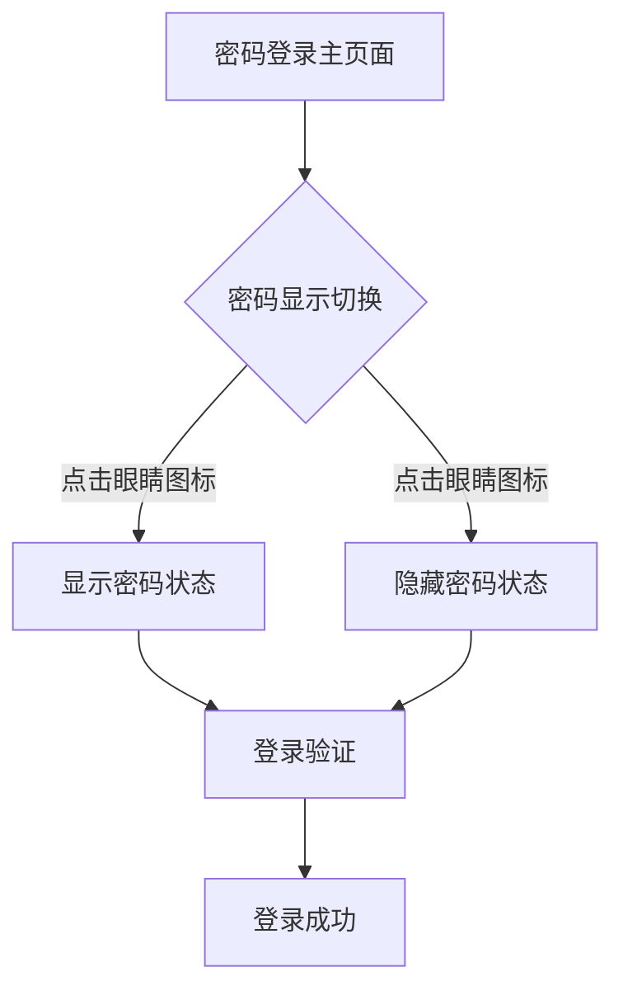
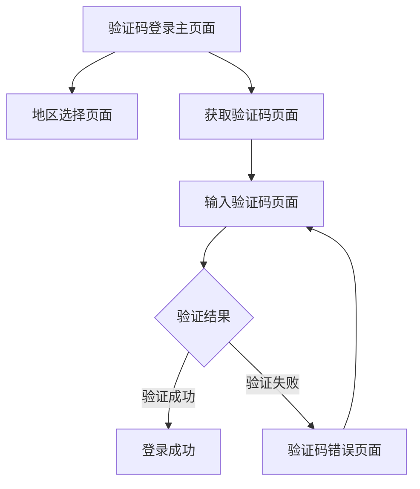
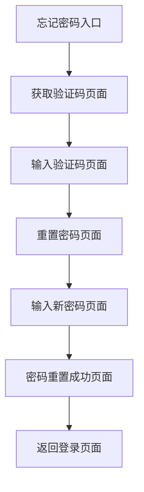

# 🔐 探店APP登录模块 - 完整功能矩阵与开发指南

> **基于纯结构架构图标准模板的完整登录系统分析**

---

## 📊 **登录模块功能矩阵总览**

### 🗂️ **页面文件结构分析**

```
探店APP登录页面 (共18个页面原型)
│
├── 【密码登录模块】(3个页面)
│   ├── 登陆页-密码登陆.png                    → 基础密码登录页面
│   ├── 登陆页-密码登陆-显示密码.png            → 密码可见状态页面
│   └── 登陆页-密码登陆-隐藏密码.png            → 密码隐藏状态页面
│
├── 【验证码登录模块】(5个页面)
│   ├── 登陆页-验证码登陆.png                  → 验证码登录主页面
│   ├── 登陆页-验证码登陆-号码地区.png          → 地区选择页面
│   ├── 登陆页-获取验证码.png                  → 验证码获取页面
│   ├── 登陆页-输入验证码.png                  → 验证码输入页面
│   └── 登陆页-输入验证码-验证码错误.png        → 验证码错误状态页面
│
└── 【忘记密码模块】(6个页面)
    ├── 登陆页-忘记密码.png                    → 忘记密码入口页面
    ├── 登陆页-忘记密码-获取验证码.png          → 验证码发送页面
    ├── 登陆页-忘记密码-输入验证码.png          → 验证码验证页面
    ├── 登陆页-忘记密码-重置密码.png            → 密码重置页面
    ├── 登陆页-忘记密码-输入新密码.png          → 新密码输入页面
    └── 登陆页-忘记密码-密码重置成功.png        → 重置成功页面
```

---

## 🎯 **三大核心登录流程**

### 1️⃣ **密码登录流程** (3个状态页面)



**功能特色：**
- ✅ 手机号+密码双重验证
- ✅ 密码显示/隐藏切换
- ✅ 地区代码选择支持
- ✅ 实时输入格式验证
- ✅ 登录状态智能管理

### 2️⃣ **验证码登录流程** (5个页面流程)



**功能特色：**
- ✅ 60秒倒计时机制
- ✅ 多地区号码支持
- ✅ 验证码错误处理
- ✅ 重发验证码功能
- ✅ 自动聚焦优化

### 3️⃣ **忘记密码流程** (6个页面流程)



**功能特色：**
- ✅ 6步骤完整流程
- ✅ 密码强度实时检测
- ✅ 双重密码确认
- ✅ 15分钟安全会话
- ✅ 成功状态反馈

---

## 🔄 **页面间流转关系图**

### 📱 **主要页面流转**

```
登录主页面 (密码模式)
    ├─→ 点击"验证码登陆" → 验证码登录主页面
    ├─→ 点击"忘记密码?" → 忘记密码入口页面
    └─→ 登录成功 → 应用主页面

验证码登录主页面
    ├─→ 点击地区代码 → 地区选择页面
    ├─→ 点击"获取验证码" → 获取验证码页面
    ├─→ 点击"密码登陆" → 登录主页面(密码模式)
    └─→ 验证成功 → 应用主页面

忘记密码流程
    ├─→ 输入手机号 → 获取验证码页面
    ├─→ 验证码验证 → 重置密码页面
    ├─→ 密码重置 → 重置成功页面
    └─→ 重置成功 → 登录主页面(密码模式)
```

### 🔀 **辅助页面流转**

```
地区选择页面
    ├─→ 选择地区 → 返回验证码登录页面
    └─→ 点击取消 → 返回验证码登录页面

验证码错误页面
    ├─→ 重新输入 → 输入验证码页面
    ├─→ 重新发送 → 获取验证码页面
    └─→ 返回上级 → 验证码登录主页面

密码显示切换
    ├─→ 隐藏状态 ↔ 显示状态
    └─→ 状态保持 → 用户偏好记忆
```

---

## 🎨 **设计系统一致性分析**

### 🎯 **统一设计语言**

| 设计元素 | 规格标准 | 应用范围 |
|---------|---------|---------|
| **主色调** | 渐变紫色 #8A2BE2 → #9370DB | 所有主要按钮、链接文字 |
| **背景色** | 纯白色 #FFFFFF | 所有页面背景 |
| **文字层级** | 28sp(标题) / 18sp(按钮) / 16sp(正文) / 14sp(辅助) | 全局文字系统 |
| **圆角规格** | 26px(按钮) / 12px(弹窗) / 8px(提示) | 统一圆角系统 |
| **间距系统** | 40px(页边距) / 24px(组件间) / 16px(元素间) | 统一布局网格 |
| **动画时长** | 0.1s(点击) / 0.3s(页面切换) / 0.5s(成功动画) | 统一动效时序 |

### 📐 **组件复用矩阵**

| 组件名称 | 密码登录 | 验证码登录 | 忘记密码 | 复用率 |
|---------|---------|-----------|---------|-------|
| **手机号输入框** | ✅ | ✅ | ✅ | 100% |
| **地区选择器** | ✅ | ✅ | ✅ | 100% |
| **主要操作按钮** | ✅ | ✅ | ✅ | 100% |
| **验证码输入框** | ❌ | ✅ | ✅ | 67% |
| **密码输入框** | ✅ | ❌ | ✅ | 67% |
| **倒计时按钮** | ❌ | ✅ | ✅ | 67% |
| **密码显示切换** | ✅ | ❌ | ✅ | 67% |
| **错误提示组件** | ✅ | ✅ | ✅ | 100% |
| **加载弹窗** | ✅ | ✅ | ✅ | 100% |
| **成功反馈页面** | ❌ | ❌ | ✅ | 33% |

---

## 🚀 **开发实施建议**

### 📋 **开发优先级排序**

#### 🥇 **第一阶段：核心登录功能** (预计2周)
1. **密码登录模块** - 基础登录能力
   - 手机号输入和验证
   - 密码输入和显示切换
   - 登录API集成和状态管理
   
2. **基础UI组件库** - 可复用组件
   - 输入框组件 (手机号/密码/验证码)
   - 按钮组件 (主要/次要/文字按钮)
   - 地区选择组件

#### 🥈 **第二阶段：验证码登录** (预计1.5周)
1. **验证码发送功能**
   - 短信API集成
   - 倒计时功能实现
   - 地区选择弹窗
   
2. **验证码验证功能**
   - 验证码输入组件
   - 错误状态处理
   - 重发机制

#### 🥉 **第三阶段：忘记密码流程** (预计2周)
1. **密码重置会话管理**
   - 15分钟会话机制
   - 状态持久化
   - 安全验证
   
2. **密码强度检测**
   - 实时强度指示
   - 历史密码检查
   - 双重确认验证

#### 🏅 **第四阶段：优化和完善** (预计1周)
1. **性能优化**
   - 页面预加载
   - 动画性能优化
   - 内存管理优化
   
2. **用户体验优化**
   - 无障碍功能
   - 错误恢复机制
   - 智能提示功能

### 🛠️ **技术栈建议**

#### **前端技术栈**
```typescript
// 核心框架
React 18+ + TypeScript 4.8+
React Router 6+ (页面路由)
Zustand / Redux Toolkit (状态管理)

// UI组件库
Ant Design Mobile / Vant (基础组件)
Framer Motion (动画库)
React Hook Form (表单管理)

// 工具库
Axios (HTTP请求)
Day.js (时间处理)
Crypto-js (加密处理)
React Query (数据缓存)
```

#### **后端API设计**
```typescript
// 登录相关API
POST /api/auth/login              // 密码登录
POST /api/auth/sms/send          // 发送验证码
POST /api/auth/sms/verify        // 验证码验证
POST /api/auth/forgot-password   // 忘记密码请求
POST /api/auth/reset-password    // 密码重置
GET  /api/regions                // 地区数据
```

### 📊 **质量保证建议**

#### **测试策略**
1. **单元测试** (覆盖率 ≥ 80%)
   - 输入验证函数测试
   - 状态管理逻辑测试
   - 工具函数测试

2. **集成测试**
   - 完整登录流程测试
   - API接口集成测试
   - 页面跳转流程测试

3. **端到端测试**
   - 用户完整操作路径
   - 异常情况处理测试
   - 多设备兼容性测试

#### **性能指标**
- **首屏加载时间** ≤ 2秒
- **页面切换动画** ≤ 300ms
- **API响应时间** ≤ 1秒
- **内存使用** ≤ 50MB
- **包体积** ≤ 2MB (gzipped)

---

## ✅ **开发完成检查清单**

### 🎯 **功能完成度检查**
- [ ] 密码登录功能完整实现
- [ ] 验证码登录功能完整实现  
- [ ] 忘记密码流程完整实现
- [ ] 所有页面间跳转正常
- [ ] 错误状态处理完善
- [ ] 加载状态显示正确

### 🎨 **UI/UX完成度检查**
- [ ] 所有页面像素级还原设计稿
- [ ] 动画效果符合设计规范
- [ ] 响应式布局适配完成
- [ ] 深色模式支持(可选)
- [ ] 无障碍功能支持
- [ ] 多语言支持(可选)

### 🔐 **安全性检查**
- [ ] 密码加密传输
- [ ] 验证码安全机制
- [ ] 会话安全管理
- [ ] 防暴力破解机制
- [ ] 敏感信息保护
- [ ] 审计日志记录

### 📱 **兼容性检查**
- [ ] iOS Safari 兼容性
- [ ] Android Chrome 兼容性
- [ ] 微信内置浏览器兼容性
- [ ] 不同屏幕尺寸适配
- [ ] 横竖屏切换支持
- [ ] 网络异常处理

---

这份完整的功能矩阵和开发指南基于您提供的18个页面原型，为探店APP登录模块提供了全面的开发路线图！🚀
