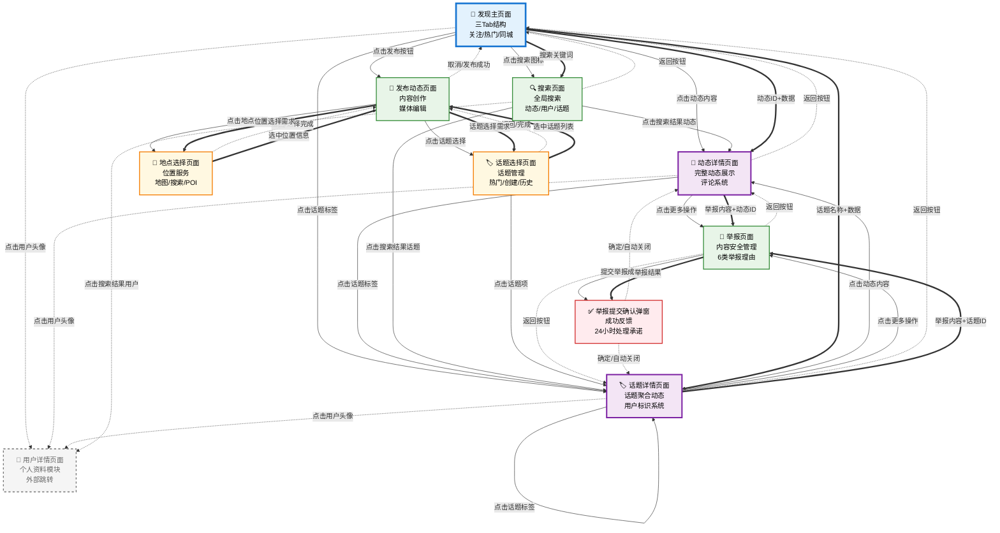

# 发现页面模块架构设计文档

> **基于纯结构架构图标准模板的完整页面架构设计**

---

## 📋 **文档信息**

- **模块名称**：发现页面系统模块
- **页面类型**：社交内容发现页面（关注/热门/同城三Tab结构）
- **设计标准**：SMART-V+ 增强原则 + 4C+1 设计标准
- **创建日期**：2025年9月26日
- **版本号**：v1.0

---

## 🌳 发现页面模块 - 树状图（页面结构视角）

```
【发现页面系统模块】★★★
│
├── 【发现主页面】📱（社交内容发现页 - 白色背景）
│   ├── 📱 系统状态栏 (9:41时间 + 信号电池显示 - 44px高度)
│   │
│   ├── 🔝 发现页导航栏 (固定头部 - 高度56px - 白色背景)
│   │   ├── 🏷️ Tab切换区域 (水平居中分布 - 占据主要宽度)
│   │   │   ├── 📝「关注」Tab (左侧 - 16sp字体)
│   │   │   │   ├── 未选中状态：灰色#999999 + 普通字重
│   │   │   │   ├── 选中状态：黑色#000000 + 粗体字重
│   │   │   │   └── 底部指示器：2px紫色线条 (选中时显示)
│   │   │   ├── 📝「热门」Tab (中间 - 相同规格)
│   │   │   │   ├── 选中状态：黑色#000000 + 粗体字重 + 底部紫色指示器
│   │   │   │   └── Tab切换动画：0.3s平滑过渡效果
│   │   │   └── 📝「同城」Tab (右侧 - 相同规格)
│   │   │       ├── 未选中状态：灰色#999999 + 普通字重
│   │   │       └── 点击切换：Tab状态切换 + 内容区域切换
│   │   │
│   │   └── 🔍 搜索功能入口 (右上角 - 24x24px灰色搜索图标)
│   │       ├── 图标样式：线性搜索图标 + 点击放大效果
│   │       ├── 点击效果：0.2s缩放动画
│   │       └── 跳转功能：进入搜索页面
│   │
│   ├── 📄 主内容区域 (可滚动容器 - 弹性高度)
│   │   │
│   │   ├── 【关注Tab内容】📋 (关注用户动态流)
│   │   │   └── 《关注动态列表》📋 (垂直滚动瀑布流)
│   │   │       ├── 💬《动态卡片1》📋 (用户动态卡片 - 可变高度)
│   │   │       │   ├── 📱 卡片容器 (白色背景 + 底部分隔线1px #F5F5F5)
│   │   │       │   ├── 👤 用户信息区域 (顶部 - 左边距16px)
│   │   │       │   │   ├── 🖼️ 用户头像 (圆形40x40px - 左上角)
│   │   │       │   │   │   ├── 头像样式：圆形裁剪 + 2px白色边框
│   │   │       │   │   │   ├── 头像加载：占位图 + 渐进式加载
│   │   │       │   │   │   └── 点击功能：跳转用户详情页
│   │   │       │   │   ├── 📝 用户昵称 "用户名称" (头像右侧8px - 16sp黑色粗体)
│   │   │       │   │   ├── 🕐 发布时间 "1小时前" (昵称下方 - 12sp灰色)
│   │   │       │   │   └── 🔻 更多操作 (右上角 - 三点图标 24x24px)
│   │   │       │   │       ├── 图标样式：灰色三点垂直图标
│   │   │       │   │       └── 点击功能：弹出操作菜单（举报/屏蔽）
│   │   │       │   │
│   │   │       │   ├── 📝 动态文字内容区域 (用户信息下方16px间距)
│   │   │       │   │   ├── 内容文字 "请你们看雪" (16sp黑色 - 左边距56px)
│   │   │       │   │   ├── 文字显示：多行显示 + 自动换行
│   │   │       │   │   ├── 话题标签：#话题# 蓝色高亮显示
│   │   │       │   │   └── @用户：@用户名 蓝色高亮显示
│   │   │       │   │
│   │   │       │   ├── 🖼️ 媒体内容区域 (文字下方12px间距)
│   │   │       │   │   ├── 📷 图片内容展示 (可变尺寸 - 最大宽度屏幕-32px)
│   │   │       │   │   │   ├── 单图：等比缩放显示 + 圆角8px
│   │   │       │   │   │   ├── 多图：网格布局 + 3列显示 + 2px间距
│   │   │       │   │   │   ├── 图片加载：占位图 + 渐进式加载
│   │   │       │   │   │   └── 点击功能：全屏查看 + 左右滑动浏览
│   │   │       │   │   ├── 🎬 视频内容展示 (16:9比例 + 播放按钮)
│   │   │       │   │   │   ├── 视频封面：缩略图 + 播放图标overlay
│   │   │       │   │   │   ├── 播放按钮：白色圆形背景 + 三角播放图标
│   │   │       │   │   │   ├── 时长显示：右下角白色背景 + 黑色文字
│   │   │       │   │   │   └── 点击功能：全屏播放视频
│   │   │       │   │   └── 📍 位置信息 (可选显示 - 媒体下方)
│   │   │       │   │       ├── 位置图标：灰色定位图标 + 位置文字
│   │   │       │   │       └── 点击功能：查看位置详情
│   │   │       │   │
│   │   │       │   └── 🔧 互动操作栏 (底部 - 高度48px)
│   │   │       │       ├── 💖 点赞按钮 (左侧 - 40x40px点击区域)
│   │   │       │       │   ├── 未点赞：灰色心形图标 + "88" 灰色文字
│   │   │       │       │   ├── 已点赞：红色填充心形 + "89" 红色文字
│   │   │       │       │   ├── 点击动画：0.3s心跳缩放动画
│   │   │       │       │   └── 数字动画：点赞数量变化动画
│   │   │       │       ├── 💬 评论按钮 (点赞右侧48px - 40x40px点击区域)
│   │   │       │       │   ├── 图标样式：灰色对话框图标
│   │   │       │       │   ├── 评论数量显示：灰色文字
│   │   │       │       │   └── 点击功能：进入评论详情页
│   │   │       │       ├── 📤 分享按钮 (评论右侧48px - 40x40px点击区域)
│   │   │       │       │   ├── 图标样式：灰色分享图标
│   │   │       │       │   └── 点击功能：弹出分享选项菜单
│   │   │       │       └── ⭐ 收藏按钮 (右侧 - 40x40px点击区域)
│   │   │           │       ├── 未收藏：灰色星形图标
│   │   │           │       ├── 已收藏：黄色填充星形图标
│   │   │           │       └── 点击动画：0.2s旋转缩放动画
│   │   │       │
│   │   │       ├── 💬《动态卡片2-N》📋 (重复相同结构 - 不同内容数据)
│   │   │       │   └── ... (相同的动态卡片结构，内容和媒体类型不同)
│   │   │       │
│   │   │       └── 🔄 列表控制机制
│   │   │           ├── 📊 下拉刷新：下拉显示刷新指示器 + 释放刷新
│   │   │           ├── 🔄 上滑加载：滑动到底部自动加载更多动态
│   │   │           ├── 🔚 加载状态：显示"加载中..." + 转圈动画
│   │   │           └── 📍 无更多内容："已经到底了" (12sp灰色居中)
│   │   │
│   │   ├── 【热门Tab内容】📋 (热门推荐动态流 - 相同结构)
│   │   │   └── 《热门动态列表》📋 (相同的卡片结构 + 热门算法排序)
│   │   │       ├── 🔥 热门标识：部分动态显示"热门"标签
│   │   │       ├── 📊 热度指标：显示热度分数或火焰图标
│   │   │       └── 🎯 推荐理由："因为你关注了XXX" (可选显示)
│   │   │
│   │   └── 【同城Tab内容】📋 (同城用户动态流 - 相同结构)
│   │       └── 《同城动态列表》📋 (相同的卡片结构 + 地理位置筛选)
│   │           ├── 📍 位置信息：更突出显示位置标签
│   │           ├── 🌍 距离显示："距离你500m" (位置信息补充)
│   │           └── 🏙️ 城市筛选：顶部可选城市切换功能
│   │
│   └── 📱 底部导航栏 (固定底部 - Tab导航 - 高度80px + 安全区域)
│       ├── 🏠「首页」Tab (未选中状态 - 灰色图标 + 文字)
│       ├── 💜「发现」Tab (选中状态 - 紫色图标 + 文字)
│       │   ├── 选中样式：紫色#8A2BE2图标 + 紫色文字 + 16sp字体
│       │   └── 图标动效：选中时0.2s缩放动画
│       ├── 💬「消息」Tab (未选中状态 - 灰色图标 + 文字)
│       │   └── 🔴 未读角标：红色圆形数字角标 (有未读消息时显示)
│       └── 👤「我的」Tab (未选中状态 - 灰色图标 + 文字)
│
├── 【动态详情页面】📱（单个动态的详细展示页 - 白色背景）
│   ├── 📱 系统状态栏 (9:41时间 + 信号电池显示 - 44px高度)
│   │
│   ├── 🔝 详情页导航栏 (固定头部 - 高度56px - 白色背景)
│   │   ├── 🔙「<」返回按钮 (左上角 - 黑色箭头图标 24x24px)
│   │   │   ├── 按钮样式：无背景 + 黑色箭头 + 点击区域40x40px
│   │   │   ├── 点击效果：0.2s透明度变化
│   │   │   └── 功能：返回发现页面动态列表
│   │   ├── 📝 页面标题 "动态" (居中 - 18sp黑色粗体)
│   │   └── 🔻「⋯」更多按钮 (右上角 - 三点图标 24x24px)
│   │       ├── 按钮样式：灰色三点垂直图标 + 点击区域40x40px
│   │       ├── 点击效果：0.2s缩放动画
│   │       └── 功能：弹出更多操作菜单（举报/屏蔽/复制链接）
│   │
│   ├── 📄 动态详情内容区 (可滚动容器 - 弹性高度)
│   │   ├── 💬《原动态完整展示》📋 (动态主体内容 - 详细展示)
│   │   │   ├── 📱 动态容器 (白色背景 + 左右边距16px)
│   │   │   ├── 👤 用户信息区域 (顶部区域)
│   │   │   │   ├── 🖼️ 用户头像 (圆形48x48px - 左上角)
│   │   │   │   │   ├── 头像样式：圆形裁剪 + 2px白色边框
│   │   │   │   │   ├── 头像加载：占位图 + 渐进式加载
│   │   │   │   │   └── 点击功能：跳转用户详情页
│   │   │   │   ├── 📝 用户信息文字区域 (头像右侧12px)
│   │   │   │   │   ├── 📝 用户昵称 "用户名称" (18sp黑色粗体)
│   │   │   │   │   ├── 🕐 发布时间 "2小时前" (昵称下方4px - 14sp灰色)
│   │   │   │   │   └── 📍 位置信息 "深圳市南山区" (时间下方4px - 14sp灰色 + 定位图标)
│   │   │   │   └── 🔘 关注按钮 (右上角 - 可选显示)
│   │   │   │       ├── 未关注状态：紫色边框 + 白色背景 + "关注" 紫色文字
│   │   │   │       ├── 已关注状态：灰色边框 + 白色背景 + "已关注" 灰色文字
│   │   │   │       ├── 按钮尺寸：64x28px + 圆角14px
│   │   │   │       └── 点击效果：0.2s状态切换动画
│   │   │   │
│   │   │   ├── 📝 动态文字内容区域 (用户信息下方20px间距)
│   │   │   │   ├── 内容文字 "请你们看雪❄️ 这雪下得好大啊！" (16sp黑色 - 行距1.4)
│   │   │   │   ├── 文字显示：多行显示 + 自动换行 + 完整展示
│   │   │   │   ├── 话题标签：#话题# 蓝色高亮显示 + 可点击
│   │   │   │   ├── @用户：@用户名 蓝色高亮显示 + 可点击
│   │   │   │   └── 表情符号：原生表情正常显示
│   │   │   │
│   │   │   ├── 🖼️ 媒体内容区域 (文字下方16px间距)
│   │   │   │   ├── 📷《图文动态展示》📋 (图片内容展示)
│   │   │   │   │   ├── 🖼️ 图片展示 (可变尺寸 - 最大宽度屏幕-32px)
│   │   │   │   │   │   ├── 单图：等比缩放显示 + 圆角12px + 最大高度400px
│   │   │   │   │   │   ├── 多图：网格布局 + 2-3列显示 + 4px间距 + 圆角8px
│   │   │   │   │   │   ├── 图片加载：占位图 + 渐进式加载 + 加载进度
│   │   │   │   │   │   ├── 点击功能：全屏查看 + 左右滑动浏览 + 缩放功能
│   │   │   │   │   │   └── 长按功能：保存图片到本地相册
│   │   │   │   │   └── 📊 图片信息 (图片下方 - 可选显示)
│   │   │   │   │       ├── 图片数量："1/3" (右下角 - 12sp白色文字 + 半透明黑色背景)
│   │   │   │   │       └── 拍摄信息：设备型号、拍摄时间等 (可选显示)
│   │   │   │   │
│   │   │   │   └── 🎬《视频动态展示》📋 (视频内容展示)
│   │   │   │       ├── 🎬 视频播放器 (16:9比例 + 圆角12px)
│   │   │   │       │   ├── 视频封面：高清缩略图 + 居中显示
│   │   │   │       │   ├── 播放按钮：白色圆形背景 + 三角播放图标 (48x48px)
│   │   │   │       │   ├── 时长显示：右下角白色背景 + 黑色时长文字 (如"01:23")
│   │   │   │       │   ├── 播放控制：点击播放/暂停 + 进度条 + 音量控制
│   │   │   │       │   ├── 全屏功能：双击全屏 + 横屏播放支持
│   │   │   │       │   └── 自动播放：进入页面自动播放（可设置）
│   │   │   │       ├── 📊 视频信息 (视频下方)
│   │   │   │       │   ├── 播放次数："1.2万次播放" (14sp灰色)
│   │   │   │       │   └── 视频质量："高清 1080P" (14sp灰色)
│   │   │   │       └── 🎵 音频控制
│   │   │   │           ├── 静音按钮：扬声器图标 + 点击切换
│   │   │   │           └── 音量调节：滑动条控制
│   │   │   │
│   │   │   ├── 🔧 互动操作栏 (媒体内容下方24px间距 - 高度56px)
│   │   │   │   ├── 💖 点赞按钮 (左侧 - 48x48px点击区域)
│   │   │   │   │   ├── 未点赞：灰色心形图标 + "128" 灰色文字 (16sp)
│   │   │   │   │   ├── 已点赞：红色填充心形 + "129" 红色文字 (16sp)
│   │   │   │   │   ├── 点击动画：0.3s心跳缩放动画 + 粒子效果
│   │   │   │   │   └── 数字动画：点赞数量变化弹跳动画
│   │   │   │   ├── 💬 评论按钮 (点赞右侧56px - 48x48px点击区域)
│   │   │   │   │   ├── 图标样式：灰色对话框图标 (24x24px)
│   │   │   │   │   ├── 评论数量显示："45" 灰色文字 (16sp)
│   │   │   │   │   └── 点击功能：滚动到评论区域 + 弹出输入框
│   │   │   │   ├── 📤 分享按钮 (评论右侧56px - 48x48px点击区域)
│   │   │   │   │   ├── 图标样式：灰色分享图标 (24x24px)
│   │   │   │   │   ├── 分享数量显示："12" 灰色文字 (16sp)
│   │   │   │   │   └── 点击功能：弹出分享选项菜单
│   │   │   │   └── ⭐ 收藏按钮 (右侧 - 48x48px点击区域)
│   │   │       ├── 未收藏：灰色星形图标 (24x24px)
│   │   │       ├── 已收藏：黄色填充星形图标 (24x24px)
│   │   │       ├── 点击动画：0.2s旋转缩放动画
│   │   │       └── 收藏状态：同步到个人收藏列表
│   │   │   │
│   │   │   └── 📊 动态统计信息 (互动操作栏下方16px间距)
│   │   │       ├── 📊 详细数据展示 (水平排列 - 12sp灰色文字)
│   │   │       │   ├── 浏览量："2.3万次浏览"
│   │   │       │   ├── 互动率："互动率 8.5%"
│   │   │       │   └── 发布平台："来自 iPhone 14 Pro"
│   │   │       └── 🕐 精确时间："发布于 2025年9月26日 14:30" (12sp浅灰色)
│   │   │
│   │   ├── 📋 分隔线 (动态内容与评论区域分隔 - 8px高度 + #F5F5F5背景色)
│   │   │
│   │   └── 🎯《相关推荐动态》📋 (页面底部推荐区域 - 可选显示)
│   │       ├── 📊 推荐标题 "相关动态推荐" (16sp黑色粗体 + 左边距16px)
│   │       └── 《推荐动态列表》📋 (水平滚动列表)
│   │           ├── 💬《推荐动态卡片1》📋 (小型动态卡片 - 宽度280px)
│   │           │   ├── 卡片样式：白色背景 + 圆角12px + 阴影2px
│   │           │   ├── 缩略图：动态封面图 + 圆角8px (宽度280px + 高度160px)
│   │           │   ├── 用户信息：头像 + 昵称 (简化显示)
│   │           │   ├── 内容预览：动态文字前50字符 + "..." (14sp灰色)
│   │           │   └── 点击功能：跳转到对应动态详情页
│   │           └── 💬《推荐动态卡片2-N》📋 (相同结构 - 不同推荐内容)
│   │
│   ├── 📝 评论区域 (详情页专属 - 白色背景)
│   │   ├── 📊 评论区标题 (评论统计信息)
│   │   │   ├── 📊 评论标题 "评论 45" (18sp黑色粗体 + 左边距16px)
│   │   │   ├── 🔄 排序选择 "按时间排序" (右侧 - 14sp灰色 + 下拉箭头)
│   │   │   │   ├── 排序选项：按时间/按热度/按点赞数
│   │   │   │   └── 点击功能：弹出排序选择菜单
│   │   │   └── 📋 分隔线 (1px #F0F0F0 + 16px左右边距)
│   │   │
│   │   ├── 💬《评论列表展示》📋 (垂直滚动列表)
│   │   │   ├── 💬《评论项1》📋 (单条评论 - 可变高度)
│   │   │   │   ├── 📱 评论容器 (白色背景 + 底部分隔线1px #F5F5F5)
│   │   │   │   ├── 👤 评论用户信息 (左侧区域)
│   │   │   │   │   ├── 🖼️ 用户头像 (圆形36x36px - 左边距16px)
│   │   │   │   │   │   ├── 头像样式：圆形裁剪 + 1px灰色边框
│   │   │   │   │   │   └── 点击功能：跳转用户详情页
│   │   │   │   │   └── 📝 用户信息文字 (头像右侧8px)
│   │   │   │   │       ├── 📝 用户昵称 "评论用户" (14sp黑色粗体)
│   │   │   │   │       └── 🕐 评论时间 "3分钟前" (昵称下方2px - 12sp灰色)
│   │   │   │   ├── 📝 评论内容区域 (用户信息下方8px)
│   │   │   │   │   ├── 评论文字 "哇，好美的雪景！" (14sp黑色 - 左边距60px)
│   │   │   │   │   ├── 文字显示：多行显示 + 自动换行
│   │   │   │   │   ├── @回复：@原评论用户 蓝色高亮显示
│   │   │   │   │   └── 表情符号：原生表情正常显示
│   │   │   │   ├── 🔧 评论操作区域 (评论内容下方8px)
│   │   │   │   │   ├── 💖 评论点赞 (左侧 - 32x32px点击区域)
│   │   │   │   │   │   ├── 未点赞：灰色心形图标 + "12" 灰色文字 (12sp)
│   │   │   │   │   │   ├── 已点赞：红色填充心形 + "13" 红色文字 (12sp)
│   │   │   │   │   │   └── 点击动画：0.2s缩放动画
│   │   │   │   │   ├── 💬 回复评论 (点赞右侧32px - 32x32px点击区域)
│   │   │   │   │   │   ├── 图标样式：灰色回复图标 (16x16px)
│   │   │   │   │   │   ├── 回复文字："回复" (12sp灰色)
│   │   │   │   │   │   └── 点击功能：弹出回复输入框
│   │   │   │   │   └── 🔻 更多操作 (右侧 - 32x32px点击区域)
│   │   │   │   │       ├── 图标样式：灰色三点图标 (16x16px)
│   │   │   │   │       └── 点击功能：弹出评论操作菜单（举报/删除）
│   │   │   │   └── 🔄《子评论列表》📋 (回复评论 - 可选显示)
│   │   │   │       ├── 📱 子评论容器 (浅灰色背景#F8F8F8 + 左边距60px)
│   │   │   │       ├── 💬《子评论项1》📋 (回复评论项 - 简化结构)
│   │   │   │       │   ├── 📝 回复内容 "@原评论用户 我也觉得很美" (12sp黑色)
│   │   │   │       │   ├── 👤 回复用户 "回复用户名" (12sp蓝色)
│   │   │   │       │   ├── 🕐 回复时间 "1分钟前" (12sp浅灰色)
│   │   │   │       │   └── 💖 回复点赞 (简化点赞功能)
│   │   │   │       ├── 💬《子评论项2-N》📋 (更多回复 - 相同结构)
│   │   │   │       └── 📝 查看更多回复 "查看全部3条回复" (12sp蓝色 + 可点击)
│   │   │   │
│   │   │   ├── 💬《评论项2-N》📋 (更多评论 - 相同结构)
│   │   │   │   └── ... (相同的评论项结构，内容和用户不同)
│   │   │   │
│   │   │   └── 🔄 评论列表控制机制
│   │   │       ├── 📊 加载更多：滑动到底部自动加载更多评论
│   │   │       ├── 🔚 加载状态："加载中..." + 转圈动画
│   │   │       └── 📍 无更多评论："已显示全部评论" (12sp灰色居中)
│   │   │
│   │   └── 📝《评论输入框》📋 (固定底部输入区域)
│   │       ├── 📱 输入框容器 (白色背景 + 顶部分隔线1px #E0E0E0)
│   │       ├── 🖼️ 用户头像 (圆形32x32px - 左边距16px + 垂直居中)
│   │       ├── 📝 评论输入框 (头像右侧12px - 占据主要宽度)
│   │       │   ├── 输入框样式：灰色边框1px + 圆角20px + 内边距12px
│   │       │   ├── 占位符文字："说点什么..." (14sp灰色)
│   │       │   ├── 输入框高度：最小40px + 自适应高度（最大120px）
│   │       │   ├── 字数限制：最大500字符 + 实时字数统计
│   │       │   └── 输入增强：支持@用户 + 表情符号
│   │       ├── 📤 发送按钮 (右侧 - 32x32px)
│   │       │   ├── 按钮样式：紫色圆形背景 + 白色发送图标
│   │       │   ├── 按钮状态：有内容时紫色，无内容时灰色
│   │       │   ├── 点击效果：0.2s缩放动画
│   │       │   └── 功能：发送评论 + 清空输入框 + 更新评论列表
│   │       └── 📱 底部安全区域 (iPhone适配 - 34px高度)
│   │
│   └── 🔧《更多操作菜单》📋 (导航栏更多按钮弹出菜单)
│       ├── 📱 菜单容器 (白色背景 + 圆角12px + 阴影4px)
│       ├── 🚨《举报动态》📋 (举报功能入口)
│       │   ├── 📱 菜单项 (高度48px + 左右边距16px)
│       │   ├── 🚨 举报图标 (左侧 - 红色警告图标 20x20px)
│       │   ├── 📝 菜单文字 "举报" (图标右侧8px - 16sp黑色)
│       │   └── 点击功能：进入举报页面
│       ├── 🚫《屏蔽用户》📋 (屏蔽功能入口)
│       │   ├── 📱 菜单项 (相同样式)
│       │   ├── 🚫 屏蔽图标 (左侧 - 灰色屏蔽图标 20x20px)
│       │   ├── 📝 菜单文字 "不感兴趣" (16sp黑色)
│       │   └── 点击功能：屏蔽该用户 + 隐藏相关动态
│       ├── 🔗《复制链接》📋 (分享功能)
│       │   ├── 📱 菜单项 (相同样式)
│       │   ├── 🔗 链接图标 (左侧 - 灰色链接图标 20x20px)
│       │   ├── 📝 菜单文字 "复制链接" (16sp黑色)
│       │   └── 点击功能：复制动态分享链接到剪贴板
│       └── 📱 菜单遮罩 (半透明黑色背景 + 点击关闭菜单)
│
├── 【举报页面】📱（举报功能页面 - 内容安全管理）
│   ├── 📱 系统状态栏 (9:41时间 + 信号电池显示 - 44px高度)
│   │
│   ├── 🔝 举报页导航栏 (固定头部 - 高度56px - 白色背景)
│   │   ├── 🔙「<」返回按钮 (左上角 - 黑色箭头图标 24x24px)
│   │   │   ├── 按钮样式：无背景 + 黑色箭头 + 点击区域40x40px
│   │   │   ├── 点击效果：0.2s透明度变化
│   │   │   └── 功能：返回动态详情页面
│   │   ├── 📝 页面标题 "举报" (居中 - 18sp黑色粗体)
│   │   └── 📤「提交」按钮 (右上角 - 紫色文字 16sp)
│   │       ├── 按钮样式：无背景 + 紫色#8A2BE2文字
│   │       ├── 按钮状态：选择举报理由后紫色，未选择时灰色
│   │       ├── 点击效果：0.2s缩放动画
│   │       └── 功能：提交举报内容
│   │
│   ├── 📄 举报内容区域 (可滚动容器)
│   │   ├── 📊 举报说明 (顶部说明区域)
│   │   │   ├── 📝 说明标题 "请选择举报理由" (18sp黑色粗体 + 左边距16px)
│   │   │   ├── 📝 说明文字 "我们将严格保护您的隐私，感谢您的反馈" (14sp灰色 + 左边距16px)
│   │   │   └── 📋 分隔线 (1px #F0F0F0 + 上下边距16px)
│   │   │
│   │   ├── 🚨《举报理由选择》📋 (举报原因列表)
│   │   │   ├── 🚨《举报理由1》📋 (垃圾信息 - 选择项)
│   │   │   │   ├── 📱 理由容器 (白色背景 + 高度56px + 底部分隔线1px #F5F5F5)
│   │   │   │   ├── ☑️ 选择框 (左侧 - 圆形选择框 20x20px + 左边距16px)
│   │   │   │   │   ├── 未选中：灰色圆形边框 + 透明背景
│   │   │   │   │   ├── 已选中：紫色圆形背景 + 白色勾选图标
│   │   │   │   │   └── 切换动画：0.2s缩放 + 颜色变化动画
│   │   │   │   ├── 📝 理由文字 "垃圾信息" (选择框右侧12px - 16sp黑色)
│   │   │   │   ├── 📝 理由描述 "广告、营销信息等" (理由下方2px - 12sp灰色)
│   │   │   │   ├── 点击区域：整个理由项可点击
│   │   │   │   └── 选择逻辑：单选模式（只能选择一个理由）
│   │   │   │
│   │   │   ├── 🚨《举报理由2》📋 (不当内容 - 选择项)
│   │   │   │   ├── 📱 理由容器 (相同样式规格)
│   │   │   │   ├── ☑️ 选择框 (相同样式)
│   │   │   │   ├── 📝 理由文字 "不当内容" (16sp黑色)
│   │   │   │   ├── 📝 理由描述 "色情、暴力、血腥等" (12sp灰色)
│   │   │   │   └── 选择功能：单选切换
│   │   │   │
│   │   │   ├── 🚨《举报理由3》📋 (侵权内容 - 选择项)
│   │   │   │   ├── 📱 理由容器 (相同样式规格)
│   │   │   │   ├── ☑️ 选择框 (相同样式)
│   │   │   │   ├── 📝 理由文字 "侵权内容" (16sp黑色)
│   │   │   │   ├── 📝 理由描述 "盗用他人作品、肖像等" (12sp灰色)
│   │   │   │   └── 选择功能：单选切换
│   │   │   │
│   │   │   ├── 🚨《举报理由4》📋 (虚假信息 - 选择项)
│   │   │   │   ├── 📱 理由容器 (相同样式规格)
│   │   │   │   ├── ☑️ 选择框 (相同样式)
│   │   │   │   ├── 📝 理由文字 "虚假信息" (16sp黑色)
│   │   │   │   ├── 📝 理由描述 "谣言、不实消息等" (12sp灰色)
│   │   │   │   └── 选择功能：单选切换
│   │   │   │
│   │   │   ├── 🚨《举报理由5》📋 (骚扰他人 - 选择项)
│   │   │   │   ├── 📱 理由容器 (相同样式规格)
│   │   │   │   ├── ☑️ 选择框 (相同样式)
│   │   │   │   ├── 📝 理由文字 "骚扰他人" (16sp黑色)
│   │   │   │   ├── 📝 理由描述 "恶意@用户、言语攻击等" (12sp灰色)
│   │   │   │   └── 选择功能：单选切换
│   │   │   │
│   │   │   └── 🚨《举报理由6》📋 (其他 - 选择项)
│   │   │       ├── 📱 理由容器 (相同样式规格)
│   │   │       ├── ☑️ 选择框 (相同样式)
│   │   │       ├── 📝 理由文字 "其他" (16sp黑色)
│   │   │       ├── 📝 理由描述 "其他违规行为" (12sp灰色)
│   │   │       └── 选择功能：单选切换
│   │   │
│   │   └── 📝《详细说明》📋 (补充说明输入区域)
│   │       ├── 📊 说明标题 "详细说明（可选）" (16sp黑色粗体 + 左边距16px)
│   │       ├── 📝《说明输入框》📋 (多行文本输入)
│   │       │   ├── 📱 输入框容器 (白色背景 + 灰色边框1px + 圆角8px + 16px边距)
│   │       │   ├── 📝 占位符文字 "请详细描述违规行为，帮助我们更好地处理" (14sp灰色)
│   │       │   ├── 输入框样式：多行文本框 + 无边框 + 14sp黑色字体
│   │       │   ├── 输入框尺寸：最小高度80px + 自适应高度（最大200px）
│   │       │   ├── 字数限制：最大500字符 + 实时字数统计
│   │       │   └── 字数显示："0/500" (右下角 - 12sp灰色)
│   │       └── 📊 提示信息 "提交后我们将在24小时内处理" (12sp浅灰色 + 左边距16px)
│   │
│   └── 📱 底部安全区域 (iPhone适配 - 34px高度)
│
├── 【举报提交确认弹窗】📋（举报提交成功反馈）
│   ├── 📱 弹窗遮罩 (半透明黑色背景 + 点击关闭弹窗)
│   ├── 📱 弹窗容器 (白色背景 + 圆角16px + 阴影8px + 居中显示)
│   │   ├── 弹窗尺寸：宽度280px + 高度200px
│   │   └── 弹窗位置：屏幕居中 + 垂直居中
│   ├── ✅ 成功图标 (绿色勾选图标 - 48x48px + 顶部居中)
│   ├── 📝 成功标题 "举报已提交" (18sp黑色粗体 + 居中 + 图标下方16px)
│   ├── 📝 成功说明 "感谢您的反馈，我们将在24小时内处理" (14sp灰色 + 居中 + 多行显示)
│   ├── 📤「确定」按钮 (底部 - 紫色背景按钮)
│   │   ├── 按钮样式：紫色#8A2BE2背景 + 白色文字 + 圆角8px
│   │   ├── 按钮尺寸：宽度200px + 高度40px + 居中显示
│   │   ├── 点击效果：0.2s缩放动画
│   │   └── 功能：关闭弹窗 + 返回动态详情页
│   └── 🔄 自动关闭：3秒后自动关闭弹窗
│
├── 【话题详情页面】📱（话题相关动态展示页面 - 白色背景）
│   ├── 📱 系统状态栏 (9:41时间 + 信号电池显示 - 44px高度)
│   │
│   ├── 🔝 话题页导航栏 (固定头部 - 高度56px - 白色背景)
│   │   ├── 🔙「<」返回按钮 (左上角 - 黑色箭头图标 24x24px)
│   │   │   ├── 按钮样式：无背景 + 黑色箭头 + 点击区域40x40px
│   │   │   ├── 点击效果：0.2s透明度变化
│   │   │   └── 功能：返回上一页面（发现页面或话题选择页面）
│   │   └── 📝 话题标题 "S10全球总决赛" (居中 - 18sp黑色粗体)
│   │       ├── 标题样式：话题名称完整显示
│   │       ├── 字体：18sp黑色粗体字重
│   │       └── 位置：水平居中对齐
│   │
│   ├── 📊 话题信息区域 (话题统计和描述 - 可选显示)
│   │   ├── 📈 话题统计信息 (顶部统计栏 - 可选显示)
│   │   │   ├── 📊 参与人数 "1.2万人参与" (左侧 - 14sp灰色)
│   │   │   ├── 📝 动态数量 "3.5万条动态" (中间 - 14sp灰色)
│   │   │   └── 🔥 话题热度 "热度98%" (右侧 - 14sp橙色)
│   │   ├── 📝 话题描述 (话题介绍文字 - 可选显示)
│   │   │   ├── 描述内容："英雄联盟2021全球总决赛相关讨论" (16sp黑色)
│   │   │   ├── 描述样式：多行显示 + 自动换行 + 左右边距16px
│   │   │   └── 展开收起：超过3行显示"展开"按钮
│   │   └── 📋 分隔线 (8px高度 + #F5F5F5背景色)
│   │
│   ├── 📄 话题动态列表区域 (可滚动容器 - 弹性高度)
│   │   └── 《话题动态列表》📋 (垂直滚动瀑布流 - 该话题下的所有动态)
│   │       ├── 💬《话题动态卡片1》📋 (话题相关动态卡片 - 可变高度)
│   │       │   ├── 📱 卡片容器 (白色背景 + 底部分隔线1px #F5F5F5)
│   │       │   ├── 👤 用户信息区域 (顶部 - 左边距16px)
│   │       │   │   ├── 🖼️ 用户头像 (圆形40x40px - 左上角)
│   │       │   │   │   ├── 头像样式：圆形裁剪 + 2px白色边框
│   │       │   │   │   ├── 头像加载：占位图 + 渐进式加载
│   │       │   │   │   └── 点击功能：跳转用户详情页
│   │       │   │   ├── 📝 用户信息文字区域 (头像右侧8px)
│   │       │   │   │   ├── 📝 用户昵称 "用户名称123" (16sp黑色粗体)
│   │       │   │   │   ├── 👥 用户标识区域 (昵称右侧8px - 水平排列)
│   │       │   │   │   │   ├── ♀️ 性别年龄标识 "♀19" (粉色背景 + 白色文字 + 圆角标签)
│   │       │   │   │   │   │   ├── 标签样式：粉色#FF69B4背景 + 白色文字 + 圆角8px
│   │       │   │   │   │   │   ├── 标签尺寸：内边距4x6px + 12sp字体
│   │       │   │   │   │   │   └── 标签间距：右边距6px
│   │       │   │   │   │   └── 🌟 人气标识 "人气用户" (橙色背景 + 白色文字 + 圆角标签)
│   │       │   │   │   │       ├── 标签样式：橙色#FF8C00背景 + 白色文字 + 圆角8px
│   │       │   │   │   │       ├── 标签尺寸：内边距4x8px + 12sp字体
│   │       │   │   │   │       └── 显示条件：人气用户或认证用户显示
│   │       │   │   │   └── 🕐 发布时间 "01-10" (昵称下方 - 12sp灰色)
│   │       │   │   └── 🔻 更多操作 (右上角 - 三点图标 24x24px)
│   │       │   │       ├── 图标样式：灰色三点垂直图标
│   │       │   │       └── 点击功能：弹出操作菜单（举报/屏蔽/分享）
│   │       │   │
│   │       │   ├── 📝 动态文字内容区域 (用户信息下方16px间距)
│   │       │   │   ├── 📝 动态标题 "新赛季，新征程" (16sp黑色粗体 - 左边距56px)
│   │       │   │   │   ├── 标题样式：粗体显示 + 单行或双行显示
│   │       │   │   │   ├── 标题颜色：黑色#000000
│   │       │   │   │   └── 标题功能：可点击展开完整内容
│   │       │   │   ├── 📝 动态正文 "英雄联盟2021新赛季已开启，段位解锁更改让赛季初上分更激动人心❤️，速速" (16sp黑色 - 左边距56px)
│   │       │   │   │   ├── 正文样式：多行显示 + 自动换行 + 行距1.4
│   │       │   │   │   ├── 文字显示：完整展示或截断显示 + "展开"按钮
│   │       │   │   │   ├── 表情符号：❤️等表情正常显示
│   │       │   │   │   └── 特殊文字：关键词可能高亮显示
│   │       │   │   └── 🏷️ 话题标签 "#S10全球总决赛" (正文下方4px - 蓝色高亮)
│   │       │   │       ├── 标签样式：蓝色#007AFF文字 + 可点击
│   │       │   │       ├── 标签功能：点击跳转到话题详情页（当前页面刷新）
│   │       │   │       └── 标签位置：左边距56px + 与正文对齐
│   │       │   │
│   │       │   ├── 🖼️ 媒体内容区域 (文字内容下方12px间距)
│   │       │   │   └── 📷《游戏主题图片展示》📋 (单张图片展示)
│   │       │   │       ├── 🖼️ 游戏图片 (英雄联盟角色图片 - 紫色主题)
│   │       │   │       │   ├── 图片尺寸：等比缩放显示 + 圆角12px + 最大宽度屏幕-88px
│   │       │   │       │   ├── 图片样式：高质量显示 + 阴影效果2px
│   │       │   │       │   ├── 图片加载：占位图 + 渐进式加载 + 加载进度
│   │       │   │       │   ├── 点击功能：全屏查看 + 缩放功能 + 保存功能
│   │       │   │       │   └── 图片内容：游戏角色、游戏截图、相关素材等
│   │       │   │       └── 📊 图片信息 (可选显示)
│   │       │   │           ├── 图片来源：游戏官方、用户截图等
│   │       │   │           └── 图片描述：角色名称、技能展示等
│   │       │   │
│   │       │   ├── 📍 位置时间信息 (媒体内容下方12px间距)
│   │       │   │   ├── 📍 位置信息 "河北" (左侧 - 12sp灰色 + 定位图标)
│   │       │   │   │   ├── 位置样式：灰色定位图标 + 灰色文字
│   │       │   │   │   ├── 位置显示：省份或城市级别
│   │       │   │   │   └── 点击功能：查看详细位置信息
│   │       │   │   └── 🕐 发布时间 "01-10" (位置右侧16px - 12sp灰色)
│   │       │   │       ├── 时间格式：月-日格式显示
│   │       │   │       ├── 时间样式：灰色文字显示
│   │       │   │       └── 详细时间：点击显示完整时间信息
│   │       │   │
│   │       │   └── 🔧 互动操作栏 (底部 - 高度48px + 左边距56px)
│   │       │       ├── 💖 点赞按钮 (左侧 - 40x40px点击区域)
│   │       │       │   ├── 未点赞：灰色心形图标 + "11" 灰色文字 (14sp)
│   │       │       │   ├── 已点赞：红色填充心形 + "12" 红色文字 (14sp)
│   │       │       │   ├── 点击动画：0.3s心跳缩放动画
│   │       │       │   └── 数字动画：点赞数量变化弹跳动画
│   │       │       ├── 💬 评论按钮 (点赞右侧48px - 40x40px点击区域)
│   │       │       │   ├── 图标样式：灰色对话框图标 (18x18px)
│   │       │       │   ├── 评论数量显示："3" 灰色文字 (14sp)
│   │       │       │   └── 点击功能：进入动态详情页查看评论
│   │       │       ├── 📤 分享按钮 (评论右侧48px - 40x40px点击区域)
│   │       │       │   ├── 图标样式：灰色分享图标 (18x18px)
│   │       │       │   └── 点击功能：弹出分享选项菜单
│   │       │       └── ⭐ 收藏按钮 (右侧 - 40x40px点击区域)
│   │       │           ├── 未收藏：灰色星形图标 (18x18px)
│   │       │           ├── 已收藏：黄色填充星形图标 (18x18px)
│   │       │           └── 点击动画：0.2s旋转缩放动画
│   │       │
│   │       ├── 💬《话题动态卡片2-N》📋 (更多话题相关动态 - 相同结构)
│   │       │   └── ... (相同的动态卡片结构，不同的用户和内容)
│   │       │
│   │       └── 🔄 列表控制机制
│   │           ├── 📊 下拉刷新：下拉显示刷新指示器 + 释放刷新话题动态
│   │           ├── 🔄 上滑加载：滑动到底部自动加载更多话题相关动态
│   │           ├── 🔚 加载状态：显示"加载中..." + 转圈动画
│   │           ├── 📍 无更多内容："已显示全部相关动态" (12sp灰色居中)
│   │           └── 🎯 智能推荐：根据话题相关度和用户兴趣排序
│   │
│   └── 📱 底部安全区域 (iPhone适配 - 34px高度)
│
├── 【搜索页面】📱（搜索功能页面）
│   ├── 🔍 搜索输入区域 (顶部搜索栏)
│   ├── 📋 搜索结果展示 (动态/用户/话题分类)
│   ├── 🏷️ 热门话题推荐 (搜索建议区域)
│   └── 📊 搜索历史记录 (本地存储的搜索记录)
│
├── 【发布动态页面】📱（发现页面扩展功能 - 内容创作页面）
│   ├── 📱 系统状态栏 (9:41时间 + 信号电池显示 - 44px高度)
│   │
│   ├── 🔝 发布页导航栏 (固定头部 - 高度56px - 白色背景)
│   │   ├── 🔙「取消」按钮 (左上角 - 16sp黑色文字)
│   │   │   ├── 按钮样式：无背景 + 黑色文字 + 点击区域40x40px
│   │   │   ├── 点击效果：0.2s透明度变化
│   │   │   └── 功能：取消发布 + 返回发现页面（有内容时弹出确认弹窗）
│   │   ├── 📝 页面标题 "动态" (居中 - 18sp黑色粗体)
│   │   └── 📤「发布」按钮 (右上角 - 紫色渐变背景)
│   │       ├── 按钮样式：紫色#8A2BE2渐变背景 + 白色文字 + 圆角20px
│   │       ├── 按钮尺寸：60x32px + 右边距16px
│   │       ├── 按钮状态：有内容时紫色背景，无内容时灰色#CCCCCC背景
│   │       ├── 点击效果：0.2s缩放动画 + 发布处理状态
│   │       └── 功能：发布动态内容到发现页面
│   │
│   ├── 📝 内容编辑区域 (主要创作区域 - 可滚动)
│   │   ├── 《标题输入框》📋 (可选标题输入区域)
│   │   │   ├── 📱 输入框容器 (透明背景 + 底部分隔线1px #F0F0F0)
│   │   │   ├── 📝 占位符文字 "添加标题" (16sp灰色#999999)
│   │   │   ├── 输入框样式：无边框 + 16sp黑色字体 + 左边距16px
│   │   │   ├── 输入框高度：最小48px + 自适应高度
│   │   │   ├── 字数限制：最大50字符
│   │   │   └── 输入监听：实时字数统计 + 内容验证
│   │   │
│   │   ├── 《正文输入框》📋 (主要内容输入区域)
│   │   │   ├── 📱 输入框容器 (透明背景 + 占据主要高度)
│   │   │   ├── 📝 占位符文字 "添加正文" (16sp灰色#999999)
│   │   │   ├── 输入框样式：多行文本框 + 无边框 + 16sp黑色字体
│   │   │   ├── 输入框区域：左右边距16px + 最小高度200px
│   │   │   ├── 字数限制：最大1000字符 + 实时字数显示
│   │   │   ├── 输入增强：支持@用户 + #话题# + 表情符号
│   │   │   ├── 自动功能：自动保存草稿 + 智能换行
│   │   │   └── 字数统计："输入内容最多1000字" (右下角 - 12sp灰色)
│   │   │
│   │   └── 🖼️ 媒体内容区域 (图片视频添加区域)
│   │       ├── 📷《已选媒体展示》📋 (已添加的媒体内容)
│   │       │   ├── 🖼️ 图片预览卡片 (圆角8px + 阴影2px)
│   │       │   │   ├── 图片尺寸：100x100px正方形 + 圆角8px
│   │       │   │   ├── 图片样式：等比缩放裁剪 + 居中显示
│   │       │   │   ├── 删除按钮：右上角白色圆形背景 + 灰色X图标
│   │       │   │   └── 编辑功能：点击图片进入编辑模式（裁剪/滤镜）
│   │       │   └── 🎬 视频预览卡片 (相同尺寸 + 播放图标overlay)
│   │       │       ├── 视频封面：缩略图 + 中央播放图标
│   │       │       ├── 时长显示：右下角白色背景 + 黑色时长文字
│   │       │       └── 编辑功能：点击进入视频编辑（裁剪/封面选择）
│   │       │
│   │       └── ➕《添加媒体按钮》📋 (添加新媒体内容)
│   │           ├── 📱 按钮容器 (虚线边框 + 圆角8px + 100x100px)
│   │           ├── ➕ 添加图标 (居中 - 灰色加号 32x32px)
│   │           ├── 按钮样式：虚线边框#DDDDDD + 透明背景
│   │           ├── 点击效果：0.2s背景色变化 + 弹出媒体选择菜单
│   │           ├── 媒体限制：最多9张图片或1个视频
│   │           └── 功能：拍照/相册选择/视频录制/视频选择
│   │
│   ├── 🔧 功能扩展区域 (附加功能区域)
│   │   ├── 🏷️《话题选择》📋 (话题标签功能)
│   │   │   ├── 📱 功能卡片 (白色背景 + 底部分隔线1px #F0F0F0)
│   │   │   ├── 🏷️ 话题图标 (左侧 - 灰色井号图标 24x24px + 左边距16px)
│   │   │   ├── 📝 功能标题 "选择话题" (图标右侧8px - 16sp黑色)
│   │   │   ├── 🔻 已选话题展示 (标题下方 - 可选显示)
│   │   │   │   ├── 话题标签："# S10全球总决赛 ×" (蓝色背景 + 白色文字)
│   │   │   │   ├── 标签样式：圆角12px + 蓝色#007AFF背景 + 内边距8x12px
│   │   │   │   ├── 删除按钮：标签右侧白色X图标
│   │   │   │   └── 多标签：水平排列 + 8px间距 + 自动换行
│   │   │   ├── 🔻 右侧箭头 (右边距16px - 灰色右箭头 16x16px)
│   │   │   ├── 点击区域：整个卡片可点击
│   │   │   └── 跳转功能：进入话题选择页面
│   │   │
│   │   └── 📍《地点选择》📋 (位置标记功能)
│   │       ├── 📱 功能卡片 (相同样式规格)
│   │       ├── 📍 位置图标 (左侧 - 灰色定位图标 24x24px + 左边距16px)
│   │       ├── 📝 功能标题 "选择地点" (图标右侧8px - 16sp黑色)
│   │       ├── 🔻 已选地点展示 (标题下方 - 可选显示)
│   │       │   ├── 地点信息："深圳市南山区" (16sp灰色 - 具体地址)
│   │       │   ├── 地点样式：普通文字显示 + 可点击修改
│   │       │   └── 精确度：支持具体地址定位
│   │       ├── 🔻 右侧箭头 (相同样式)
│   │       ├── 点击区域：整个卡片可点击
│   │       └── 跳转功能：进入地点选择页面
│   │
│   └── 📱 底部安全区域 (iPhone适配 - 34px高度 + 白色背景)
│
├── 【话题选择页面】📱（发布动态子功能 - 话题选择功能页面）
│   ├── 📱 系统状态栏 (9:41时间 + 信号电池显示 - 44px高度)
│   │
│   ├── 🔝 话题页导航栏 (固定头部 - 高度56px - 白色背景)
│   │   ├── 🔙「<」返回按钮 (左上角 - 黑色箭头图标 24x24px)
│   │   ├── 📝 页面标题 "选择话题" (居中 - 18sp黑色粗体)
│   │   └── ✅「完成」按钮 (右上角 - 紫色文字 16sp)
│   │       ├── 按钮样式：无背景 + 紫色#8A2BE2文字
│   │       ├── 按钮状态：有选择时紫色，无选择时灰色
│   │       └── 功能：确认选择并返回发布页面
│   │
│   ├── 🔍 搜索功能区域 (话题搜索区域)
│   │   ├── 《话题搜索框》📋 (搜索输入框)
│   │   │   ├── 📱 搜索框容器 (白色背景 + 圆角8px + 灰色边框1px)
│   │   │   ├── 🔍 搜索图标 (左侧 - 灰色搜索图标 20x20px + 左边距12px)
│   │   │   ├── 📝 输入框 "搜索话题" (占位符 - 16sp灰色)
│   │   │   ├── 输入框样式：无边框 + 16sp黑色字体 + 高度40px
│   │   │   ├── 🔄 搜索功能：实时搜索 + 防抖300ms + 历史记录
│   │   │   └── 清除按钮：有输入时显示右侧X图标清除
│   │   │
│   │   └── 📊 搜索结果展示 (动态搜索结果)
│   │       ├── 🔥 热门话题推荐 (无搜索时显示)
│   │       ├── 📋 搜索结果列表 (有搜索时显示)
│   │       └── 📍 无结果提示 (搜索无结果时显示)
│   │
│   ├── 📋 话题分类区域 (话题内容展示区域)
│   │   ├── 🔥《热门话题》📋 (热门话题推荐区域)
│   │   │   ├── 📊 区域标题 "热门话题" (16sp黑色粗体 + 左边距16px)
│   │   │   └── 《热门话题列表》📋 (垂直滚动列表)
│   │   │       ├── 🏷️《话题项1》📋 (话题选择项 - 高度60px)
│   │   │       │   ├── 📱 话题容器 (白色背景 + 底部分隔线1px #F0F0F0)
│   │   │       │   ├── 🏷️ 话题图标 (左侧 - 蓝色井号图标 24x24px + 左边距16px)
│   │   │       │   ├── 📝 话题信息区域 (图标右侧12px)
│   │   │       │   │   ├── 📝 话题名称 "S10全球总决赛" (16sp黑色粗体)
│   │   │       │   │   ├── 📊 话题热度 "1.2万人参与" (名称下方 - 12sp灰色)
│   │   │       │   │   └── 🔥 热度标识：火焰图标 (热门话题标识)
│   │   │       │   ├── ☑️ 选择状态指示 (右侧 - 选择框)
│   │   │       │   │   ├── 未选中：灰色圆形边框 + 透明背景
│   │   │       │   │   ├── 已选中：紫色圆形背景 + 白色勾选图标
│   │   │       │   │   └── 切换动画：0.2s缩放 + 颜色变化动画
│   │   │       │   ├── 点击区域：整个话题项可点击
│   │   │       │   └── 选择逻辑：支持多选 + 最多选择5个话题
│   │   │       │
│   │   │       └── 🔄 列表控制机制
│   │   │           ├── 📊 加载更多：滑动到底部自动加载更多话题
│   │   │           └── 🔚 加载状态："加载中..." + 转圈动画
│   │   │
│   │   ├── 📝《创建话题》📋 (创建新话题功能)
│   │   │   ├── 📊 区域标题 "创建新话题" (16sp黑色粗体)
│   │   │   └── ➕《创建话题按钮》📋 (创建功能入口)
│   │   │       ├── 📱 按钮容器 (白色背景 + 圆角8px + 虚线边框)
│   │   │       ├── ➕ 创建图标 (左侧 - 紫色加号图标 24x24px)
│   │   │       ├── 📝 创建提示 "创建新话题" (16sp紫色文字)
│   │   │       ├── 点击效果：0.2s背景色变化
│   │   │       └── 功能：弹出话题创建输入框
│   │   │
│   │   └── 📊《我的话题》📋 (用户历史选择话题)
│   │       ├── 📊 区域标题 "最近使用" (16sp黑色粗体)
│   │       └── 《历史话题列表》📋 (用户历史话题记录)
│   │           └── ... (相同的话题项结构，显示用户历史选择)
│   │
│   └── 📱 底部安全区域 (iPhone适配 - 34px高度)
│
├── 【地点选择页面】📱（发布动态子功能 - 位置选择功能页面）
│   ├── 📱 系统状态栏 (9:41时间 + 信号电池显示 - 44px高度)
│   │
│   ├── 🔝 地点页导航栏 (固定头部 - 高度56px - 白色背景)
│   │   ├── 🔙「<」返回按钮 (左上角 - 黑色箭头图标 24x24px)
│   │   ├── 📝 页面标题 "选择地点" (居中 - 18sp黑色粗体)
│   │   └── 🎯「自动定位」按钮 (右上角 - 蓝色文字 14sp)
│   │       ├── 按钮样式：无背景 + 蓝色#007AFF文字 + 定位图标
│   │       ├── 按钮功能：获取用户当前GPS位置
│   │       └── 定位状态：定位中显示转圈动画
│   │
│   ├── 🗺️ 地图展示区域 (交互式地图区域 - 占据主要高度)
│   │   ├── 📱 地图容器 (全屏地图显示 - 高度约400px)
│   │   ├── 🗺️ 地图内容 (可缩放移动的交互式地图)
│   │   │   ├── 地图样式：标准地图模式 + 地点标注显示
│   │   │   ├── 地图交互：支持缩放 + 拖拽 + 双击放大
│   │   │   ├── 当前位置：蓝色圆点 + 精度圆圈显示
│   │   │   └── 地点标注：紫色定位图标标注附近地点
│   │   ├── 📍 中心定位标识 (地图中央 - 紫色定位图标)
│   │   │   ├── 图标样式：紫色背景圆形 + 白色定位图标
│   │   │   ├── 图标尺寸：40x40px + 阴影效果
│   │   │   └── 功能：指示当前选择的地理位置
│   │   └── 🔍 地图控制按钮 (地图右下角控制区域)
│   │       ├── 🎯「定位」按钮 (回到当前位置 - 圆形白色背景)
│   │       ├── ➕「放大」按钮 (地图缩放放大 - 圆形白色背景)
│   │       └── ➖「缩小」按钮 (地图缩放缩小 - 圆形白色背景)
│   │
│   ├── 🔍 地址搜索区域 (地址搜索功能区域)
│   │   ├── 《地址搜索框》📋 (位置搜索输入框)
│   │   │   ├── 📱 搜索框容器 (白色背景 + 圆角8px + 阴影2px)
│   │   │   ├── 🔍 搜索图标 (左侧 - 灰色搜索图标 20x20px)
│   │   │   ├── 📝 输入框 "搜索地址" (占位符 - 16sp灰色)
│   │   │   ├── 输入框样式：无边框 + 16sp黑色字体 + 高度44px
│   │   │   ├── 🔄 搜索功能：实时地址搜索 + 防抖500ms
│   │   │   └── 清除按钮：有输入时显示右侧X图标
│   │   │
│   │   └── 📊 搜索建议展示 (地址搜索建议列表)
│   │       ├── 🔥 热门地点推荐 (无搜索时显示)
│   │       ├── 📋 搜索建议列表 (有搜索时显示)
│   │       └── 📍 无结果提示 (搜索无结果时显示)
│   │
│   ├── 📋 地点列表区域 (附近地点列表区域 - 可滚动)
│   │   └── 《附近地点列表》📋 (垂直滚动地点列表)
│   │       ├── 📍《地点项1》📋 (地点选择项 - 高度80px)
│   │       │   ├── 📱 地点容器 (白色背景 + 底部分隔线1px #F0F0F0)
│   │       │   ├── 📍 地点图标 (左侧 - 灰色定位图标 24x24px + 左边距16px)
│   │       │   ├── 📝 地点信息区域 (图标右侧12px - 右边距16px)
│   │       │   │   ├── 📝 地点名称 "景田在线网咖" (16sp黑色粗体)
│   │       │   │   ├── 📍 详细地址 "深圳市南山区松坪山乌石头路11号3层" (14sp灰色)
│   │       │   │   │   ├── 地址显示：最多2行显示 + 超出显示省略号
│   │       │   │   │   └── 地址精度：具体到门牌号级别
│   │       │   │   └── 🌍 距离信息 "距离你约500m" (12sp浅灰色 - 可选显示)
│   │       │   ├── ☑️ 选择状态指示 (右侧 - 单选框)
│   │       │   │   ├── 未选中：灰色圆形边框 + 透明背景
│   │       │   │   ├── 已选中：紫色圆形背景 + 白色勾选图标
│   │       │   │   └── 切换动画：0.2s缩放 + 颜色变化动画
│   │       │   ├── 点击区域：整个地点项可点击
│   │       │   └── 选择逻辑：单选模式 + 选中后自动返回
│   │       │
│   │       ├── 📍《地点项2-N》📋 (重复相同结构 - 更多地点)
│   │       │   └── ... (相同的地点项结构，地点信息不同)
│   │       │
│   │       └── 🔄 列表控制机制
│   │           ├── 📊 加载更多：滑动到底部自动加载更多地点
│   │           ├── 🔄 位置更新：地图移动时自动更新附近地点
│   │           └── 🔚 加载状态："加载中..." + 转圈动画
│   │
│   └── 📱 底部安全区域 (iPhone适配 - 34px高度)
│
└── 🔧 系统支持层（底层技术服务）
    ├── 📡 内容服务
    │   ├── 「动态流API」（注：获取关注/热门/同城动态流）
    │   ├── 「动态发布API」（注：发布动态内容和审核）
    │   ├── 「媒体服务」（注：图片视频上传下载和处理）
    │   ├── 「推荐算法」（注：热门内容推荐和个性化算法）
    │   ├── 「地理位置」（注：同城内容地理位置筛选）
    │   ├── 「草稿存储服务」（注：自动保存和恢复草稿内容）
    │   └── 「内容审核服务」（注：文字图片视频内容安全审核）
    ├── 🏷️ 话题服务
    │   ├── 「话题管理服务」（注：话题创建编辑和管理）
    │   ├── 「话题搜索服务」（注：话题搜索和推荐算法）
    │   ├── 「热门话题统计」（注：话题热度计算和排序）
    │   ├── 「话题关联服务」（注：话题和内容关联关系）
    │   ├── 「话题详情服务」（注：话题信息展示和动态聚合）
    │   ├── 「话题统计分析」（注：参与人数、动态数量、热度指数计算）
    │   ├── 「话题内容质量管理」（注：话题内容审核和质量控制）
    │   └── 「话题趋势分析服务」（注：话题生命周期和趋势预测）
    ├── 📍 位置服务
    │   ├── 「GPS定位服务」（注：获取用户当前地理位置）
    │   ├── 「地图服务API」（注：地图展示和地点搜索）
    │   ├── 「地址解析服务」（注：坐标和地址相互转换）
    │   └── 「POI搜索服务」（注：附近地点搜索和推荐）
    ├── 🔐 社交服务
    │   ├── 「用户关系」（注：关注粉丝关系管理）
    │   ├── 「互动统计」（注：点赞收藏评论数据统计）
    │   ├── 「内容审核」（注：动态内容安全审核）
    │   ├── 「举报处理」（注：用户举报和内容处理）
    │   ├── 「评论管理服务」（注：评论发布、回复、点赞、删除管理）
    │   ├── 「举报审核服务」（注：举报内容分类处理和审核流程）
    │   ├── 「用户屏蔽服务」（注：用户屏蔽关系管理和内容过滤）
    │   ├── 「用户权限验证」（注：发布权限和频率限制）
    │   ├── 「敏感词过滤」（注：文字内容敏感词检测）
    │   └── 「反垃圾服务」（注：垃圾内容和刷屏检测）
    ├── 📊 缓存服务
    │   ├── 「图片缓存」（注：媒体文件本地缓存策略）
    │   ├── 「数据缓存」（注：动态列表数据缓存）
    │   ├── 「离线支持」（注：离线浏览已缓存内容）
    │   └── 「预加载」（注：智能预加载下一页内容）
    ├── 🎯 推荐服务
    │   ├── 「话题推荐算法」（注：基于用户兴趣推荐话题）
    │   ├── 「地点推荐服务」（注：基于历史和偏好推荐地点）
    │   ├── 「内容模板推荐」（注：推荐内容创作模板）
    │   └── 「发布时机建议」（注：最佳发布时间推荐）
    └── 🔬 分析服务
        ├── 「用户行为」（注：浏览点击互动行为分析）
        ├── 「内容分析」（注：热门内容趋势分析）
        ├── 「推荐优化」（注：推荐算法效果优化）
        ├── 「发布成功率统计」（注：发布成功失败率监控）
        ├── 「用户反馈收集」（注：用户体验反馈收集）
        └── 「性能监控」（注：页面加载性能和用户体验）
```

---

## 🗺️ **发现页面模块 - 页面间流程图**

### 📋 **页面架构总览**



### 📊 **页面层级结构详解**

#### 🏠 **Level 1 - 主页面层级**
- **📱 发现主页面**：模块入口，三Tab结构（关注/热门/同城），所有功能的起点
  - **核心功能**：动态列表展示、Tab切换、搜索入口、发布入口
  - **交互特点**：高频使用、状态保持、实时更新
  - **性能要求**：快速加载、流畅滚动、智能预加载

#### 📄 **Level 2 - 详情页面层级**
- **💬 动态详情页面**：单个动态的完整展示，包含评论系统
  - **核心功能**：动态完整展示、评论互动、媒体播放、相关推荐
  - **交互特点**：深度浏览、长停留时间、高互动频率
  - **性能要求**：媒体优化、评论加载、实时同步

- **🏷️ 话题详情页面**：话题相关动态聚合展示，用户标识系统
  - **核心功能**：话题动态聚合、用户标识、媒体增强、数据统计
  - **交互特点**：主题浏览、用户发现、内容筛选
  - **性能要求**：数据聚合、智能排序、统计计算

#### ⚙️ **Level 3 - 功能页面层级**
- **🔍 搜索页面**：全局搜索功能，支持动态/用户/话题搜索
  - **核心功能**：全文搜索、分类筛选、历史记录、热门推荐
  - **交互特点**：目标导向、快速查找、结果浏览
  - **性能要求**：搜索响应、结果排序、缓存优化

- **📝 发布动态页面**：内容创作主页面，支持媒体编辑
  - **核心功能**：内容编辑、媒体上传、话题选择、地点标记
  - **交互特点**：创作流程、多步操作、状态保存
  - **性能要求**：草稿保存、媒体处理、上传优化

- **🚨 举报页面**：内容安全管理，6类举报理由选择
  - **核心功能**：举报理由选择、详细说明、安全处理
  - **交互特点**：安全导向、简单操作、结果反馈
  - **性能要求**：快速提交、状态跟踪、处理反馈

#### 🔧 **Level 4 - 子功能页面层级**
- **🏷️ 话题选择页面**：发布动态的子功能，话题管理
  - **核心功能**：话题搜索、热门推荐、历史记录、创建话题
  - **交互特点**：选择导向、搜索优化、多选支持
  - **性能要求**：搜索响应、数据缓存、选择同步

- **📍 地点选择页面**：发布动态的子功能，位置服务
  - **核心功能**：地图展示、地址搜索、POI推荐、GPS定位
  - **交互特点**：地图交互、位置精确、选择确认
  - **性能要求**：地图加载、定位精度、数据同步

#### 🔔 **Level 5 - 弹窗层级**
- **✅ 举报提交确认弹窗**：操作成功反馈，24小时处理承诺
  - **核心功能**：成功确认、处理时间、自动关闭
  - **交互特点**：反馈导向、简单确认、自动消失
  - **性能要求**：即时显示、动画流畅、状态同步

### 🔄 **页面间跳转关系详解**

#### 📱 **从发现主页面出发的跳转路径**
```
发现主页面 ──┐
             ├── 点击动态内容 ────→ 动态详情页面
             ├── 点击话题标签 ────→ 话题详情页面
             ├── 点击搜索图标 ────→ 搜索页面
             ├── 点击发布按钮 ────→ 发布动态页面
             └── 点击用户头像 ────→ 用户详情页面（外部模块）
```

#### 💬 **从动态详情页面出发的跳转路径**
```
动态详情页面 ──┐
              ├── 点击返回按钮 ────→ 发现主页面
              ├── 点击更多操作 ────→ 举报页面
              ├── 点击话题标签 ────→ 话题详情页面
              ├── 点击用户头像 ────→ 用户详情页面（外部模块）
              └── 点击评论用户 ────→ 用户详情页面（外部模块）
```

#### 🏷️ **从话题详情页面出发的跳转路径**
```
话题详情页面 ──┐
              ├── 点击返回按钮 ────→ 发现主页面/话题选择页面
              ├── 点击动态内容 ────→ 动态详情页面
              ├── 点击话题标签 ────→ 话题详情页面（刷新）
              ├── 点击用户头像 ────→ 用户详情页面（外部模块）
              └── 点击更多操作 ────→ 举报页面
```

#### 🔍 **从搜索页面出发的跳转路径**
```
搜索页面 ──┐
           ├── 点击返回按钮 ────→ 发现主页面
           ├── 点击搜索结果动态 ────→ 动态详情页面
           ├── 点击搜索结果话题 ────→ 话题详情页面
           └── 点击搜索结果用户 ────→ 用户详情页面（外部模块）
```

#### 📝 **从发布动态页面出发的跳转路径**
```
发布动态页面 ──┐
              ├── 点击取消按钮 ────→ 发现主页面
              ├── 点击话题选择 ────→ 话题选择页面
              ├── 点击地点选择 ────→ 地点选择页面
              └── 发布成功后 ────→ 发现主页面
```

#### 🚨 **从举报页面出发的跳转路径**
```
举报页面 ──┐
           ├── 点击返回按钮 ────→ 动态详情页面/话题详情页面
           └── 提交举报成功 ────→ 举报提交确认弹窗
```

#### 🏷️ **从话题选择页面出发的跳转路径**
```
话题选择页面 ──┐
              ├── 点击返回按钮 ────→ 发布动态页面
              ├── 点击完成按钮 ────→ 发布动态页面
              └── 点击话题项 ────→ 话题详情页面
```

#### 📍 **从地点选择页面出发的跳转路径**
```
地点选择页面 ──┐
              ├── 点击返回按钮 ────→ 发布动态页面
              └── 选择地点完成 ────→ 发布动态页面
```

### 📊 **数据流转关系图**

#### 🔄 **页面间数据传递流向**
```
数据流向详解：

发现主页面 ────[动态ID + 动态数据]────→ 动态详情页面
发现主页面 ────[话题名称 + 话题数据]──→ 话题详情页面
发现主页面 ────[搜索关键词]────────→ 搜索页面

动态详情页面 ──[举报内容 + 动态ID]──→ 举报页面
话题详情页面 ──[举报内容 + 话题ID]──→ 举报页面
举报页面 ────[举报结果 + 处理状态]──→ 举报提交确认弹窗

发布动态页面 ──[话题选择需求]────→ 话题选择页面
发布动态页面 ──[位置选择需求]────→ 地点选择页面
话题选择页面 ──[选中话题列表]────→ 发布动态页面
地点选择页面 ──[选中位置信息]────→ 发布动态页面

话题选择页面 ──[话题名称]────────→ 话题详情页面
搜索页面 ────[搜索结果数据]────→ 动态详情页面/话题详情页面
```

#### 📋 **状态保持和缓存机制**
```
页面状态管理策略：

发现主页面：
├── Tab选中状态（关注/热门/同城）
├── 滚动位置状态（精确到像素）
├── 动态列表缓存（最近50条）
├── 用户交互状态（点赞/收藏状态）
└── 实时更新标记（新动态提示）

动态详情页面：
├── 动态数据完整缓存
├── 评论列表分页状态
├── 用户互动状态（点赞/评论/收藏）
├── 媒体播放状态（视频进度/音量）
└── 相关推荐缓存

话题详情页面：
├── 话题信息缓存
├── 相关动态列表缓存
├── 用户标识数据缓存
├── 统计数据缓存
└── 排序筛选状态

发布动态页面：
├── 草稿内容自动保存（每30秒）
├── 媒体文件临时存储
├── 话题选择状态持久化
├── 地点选择状态持久化
└── 编辑历史记录（支持撤销重做）
```

### 🎯 **页面优先级和性能策略**

#### ⚡ **页面加载优先级排序**
1. **P0 - 核心页面**：发现主页面、动态详情页面
   - **加载策略**：首屏优先、关键路径优化、预加载机制
   - **性能目标**：首屏加载 < 1s，交互响应 < 100ms

2. **P1 - 重要页面**：话题详情页面、发布动态页面
   - **加载策略**：按需加载、智能预取、缓存优先
   - **性能目标**：页面加载 < 2s，操作响应 < 200ms

3. **P2 - 功能页面**：搜索页面、举报页面
   - **加载策略**：懒加载、轻量化、快速响应
   - **性能目标**：页面加载 < 3s，搜索响应 < 500ms

4. **P3 - 子功能页面**：话题选择页面、地点选择页面
   - **加载策略**：延迟加载、数据预取、缓存复用
   - **性能目标**：页面加载 < 2s，选择响应 < 300ms

#### 🔄 **预加载和缓存策略**
```
智能预加载机制：

发现主页面：
├── 预加载热门动态前10条
├── 预加载用户关注列表
├── 预加载同城位置数据
└── 预加载搜索热词

动态详情页面：
├── 预加载相关推荐动态
├── 预加载评论前20条
├── 预加载媒体内容
└── 预加载用户互动数据

话题详情页面：
├── 预加载话题统计数据
├── 预加载相关动态前15条
├── 预加载用户标识数据
└── 预加载相关话题推荐

发布动态页面：
├── 预加载热门话题前50个
├── 预加载常用地点数据
├── 预加载用户历史选择
└── 预加载媒体处理配置
```

---

## 🔌 **发现页面模块 - 后端API接口树状图**

### 📊 **API架构总览**

```mermaid
flowchart TD
    %% 主服务接口
    API[🔌 发现页面API服务<br/>Discovery Service<br/>Base URL: /api/v1/discovery]
    
    %% 动态内容服务
    CONTENT[📄 动态内容服务<br/>Content Service<br/>/content]
    API --> CONTENT
    
    %% 用户服务
    USER[👤 用户服务<br/>User Service<br/>/user]
    API --> USER
    
    %% 话题服务
    TOPIC[🏷️ 话题服务<br/>Topic Service<br/>/topic]
    API --> TOPIC
    
    %% 位置服务
    LOCATION[📍 位置服务<br/>Location Service<br/>/location]
    API --> LOCATION
    
    %% 互动服务
    INTERACTION[💬 互动服务<br/>Interaction Service<br/>/interaction]
    API --> INTERACTION
    
    %% 搜索服务
    SEARCH[🔍 搜索服务<br/>Search Service<br/>/search]
    API --> SEARCH
    
    %% 举报服务
    REPORT[🚨 举报服务<br/>Report Service<br/>/report]
    API --> REPORT
    
    %% 媒体服务
    MEDIA[🖼️ 媒体服务<br/>Media Service<br/>/media]
    API --> MEDIA
    
    %% 动态内容服务子接口
    CONTENT --> C1[GET /feed<br/>📋 获取动态流<br/>→ 关注/热门/同城]
    CONTENT --> C2[GET /detail/{id}<br/>💬 获取动态详情<br/>→ 完整动态信息]
    CONTENT --> C3[POST /publish<br/>📝 发布动态<br/>→ 创建新动态]
    CONTENT --> C4[PUT /update/{id}<br/>✏️ 更新动态<br/>→ 编辑动态内容]
    CONTENT --> C5[DELETE /delete/{id}<br/>🗑️ 删除动态<br/>→ 删除指定动态]
    CONTENT --> C6[GET /recommend<br/>🎯 推荐动态<br/>→ 个性化推荐]
    
    %% 用户服务子接口
    USER --> U1[GET /profile/{id}<br/>👤 获取用户信息<br/>→ 用户详细资料]
    USER --> U2[GET /follow/list<br/>👥 获取关注列表<br/>→ 用户关注的人]
    USER --> U3[POST /follow/{id}<br/>➕ 关注用户<br/>→ 添加关注关系]
    USER --> U4[DELETE /follow/{id}<br/>➖ 取消关注<br/>→ 移除关注关系]
    USER --> U5[GET /followers/{id}<br/>👥 获取粉丝列表<br/>→ 用户的粉丝]
    USER --> U6[GET /tags/{id}<br/>🏷️ 获取用户标签<br/>→ 性别年龄认证等]
    
    %% 话题服务子接口
    TOPIC --> T1[GET /list<br/>📋 获取话题列表<br/>→ 热门话题列表]
    TOPIC --> T2[GET /detail/{name}<br/>🏷️ 获取话题详情<br/>→ 话题相关动态]
    TOPIC --> T3[POST /create<br/>➕ 创建话题<br/>→ 新建话题]
    TOPIC --> T4[GET /search<br/>🔍 搜索话题<br/>→ 话题搜索结果]
    TOPIC --> T5[GET /trending<br/>🔥 热门话题<br/>→ 趋势话题排行]
    TOPIC --> T6[GET /stats/{name}<br/>📊 话题统计<br/>→ 参与度数据]
    
    %% 位置服务子接口
    LOCATION --> L1[GET /nearby<br/>📍 附近地点<br/>→ POI地点列表]
    LOCATION --> L2[POST /geocode<br/>🗺️ 地址解析<br/>→ 坐标转地址]
    LOCATION --> L3[GET /search<br/>🔍 搜索地点<br/>→ 地点搜索结果]
    LOCATION --> L4[GET /city/list<br/>🏙️ 城市列表<br/>→ 支持的城市]
    
    %% 互动服务子接口
    INTERACTION --> I1[POST /like<br/>💖 点赞操作<br/>→ 点赞/取消点赞]
    INTERACTION --> I2[POST /comment<br/>💬 发表评论<br/>→ 添加评论]
    INTERACTION --> I3[GET /comments/{id}<br/>📋 获取评论列表<br/>→ 动态评论]
    INTERACTION --> I4[POST /reply<br/>↩️ 回复评论<br/>→ 评论回复]
    INTERACTION --> I5[POST /collect<br/>⭐ 收藏操作<br/>→ 收藏/取消收藏]
    INTERACTION --> I6[POST /share<br/>📤 分享动态<br/>→ 分享统计]
    
    %% 搜索服务子接口
    SEARCH --> S1[GET /all<br/>🔍 全局搜索<br/>→ 动态用户话题]
    SEARCH --> S2[GET /content<br/>📄 搜索动态<br/>→ 动态内容搜索]
    SEARCH --> S3[GET /users<br/>👤 搜索用户<br/>→ 用户搜索结果]
    SEARCH --> S4[GET /topics<br/>🏷️ 搜索话题<br/>→ 话题搜索结果]
    SEARCH --> S5[GET /suggestions<br/>💡 搜索建议<br/>→ 自动补全]
    SEARCH --> S6[GET /history<br/>📚 搜索历史<br/>→ 用户搜索记录]
    
    %% 举报服务子接口
    REPORT --> R1[POST /submit<br/>🚨 提交举报<br/>→ 举报内容]
    REPORT --> R2[GET /reasons<br/>📋 举报理由<br/>→ 举报分类列表]
    REPORT --> R3[GET /status/{id}<br/>📊 举报状态<br/>→ 处理进度]
    REPORT --> R4[POST /block<br/>🚫 屏蔽用户<br/>→ 用户屏蔽]
    
    %% 媒体服务子接口
    MEDIA --> M1[POST /upload<br/>📤 上传媒体<br/>→ 图片视频上传]
    MEDIA --> M2[GET /url/{id}<br/>🔗 获取媒体URL<br/>→ 媒体访问链接]
    MEDIA --> M3[POST /process<br/>⚙️ 媒体处理<br/>→ 压缩裁剪转码]
    MEDIA --> M4[DELETE /delete/{id}<br/>🗑️ 删除媒体<br/>→ 清理媒体文件]
    
    %% 样式定义
    classDef mainService fill:#e3f2fd,stroke:#1976d2,stroke-width:4px,color:#000
    classDef subService fill:#f3e5f5,stroke:#7b1fa2,stroke-width:3px,color:#000
    classDef getApi fill:#e8f5e8,stroke:#388e3c,stroke-width:2px,color:#000
    classDef postApi fill:#fff8e1,stroke:#f57c00,stroke-width:2px,color:#000
    classDef deleteApi fill:#ffebee,stroke:#d32f2f,stroke-width:2px,color:#000
    classDef putApi fill:#f1f8e9,stroke:#689f38,stroke-width:2px,color:#000
    
    class API mainService
    class CONTENT,USER,TOPIC,LOCATION,INTERACTION,SEARCH,REPORT,MEDIA subService
    class C1,C2,C6,U1,U2,U5,U6,T1,T2,T4,T5,T6,L1,L2,L3,L4,I3,S1,S2,S3,S4,S5,S6,R2,R3,M2 getApi
    class C3,I1,I2,I4,I5,I6,T3,R1,R4,M1,M3 postApi
    class C5,U4,M4 deleteApi
    class C4 putApi
```

### 📋 **API接口树状图详细描述**

#### 🏗️ **服务模块架构说明**

##### 🔌 **主服务节点 - 发现页面API服务**
```
🔌 发现页面API服务 (Discovery Service)
├── Base URL: /api/v1/discovery
├── 服务职责: 统一API网关入口，负责路由分发和认证授权
├── 技术特点: 微服务架构，支持水平扩展和负载均衡
├── 安全机制: JWT Token验证，请求频率限制，数据加密传输
└── 监控指标: 接口响应时间，成功率，并发量，错误统计
```

##### 📄 **动态内容服务 (Content Service)**
```
📄 动态内容服务 /content
├── 核心职责: 动态内容的完整生命周期管理
├── 业务覆盖: 内容发布、展示、编辑、删除、推荐算法
├── 数据处理: 富文本解析，话题提取，@用户识别，敏感词过滤
├── 性能优化: 内容缓存，分页加载，预加载机制
└── 子接口说明:
    ├── GET /feed → 动态流获取
    │   ├── 支持三种模式: 关注流/热门流/同城流
    │   ├── 智能推荐: 基于用户行为的个性化推荐算法
    │   ├── 实时更新: WebSocket推送新动态提醒
    │   └── 性能优化: Redis缓存热门内容，CDN加速图片加载
    │
    ├── GET /detail/{id} → 动态详情获取
    │   ├── 完整信息: 动态内容+用户信息+媒体文件+位置信息
    │   ├── 关联数据: 评论列表+点赞统计+收藏状态+分享数据
    │   ├── 推荐系统: 相关动态推荐，基于话题和用户兴趣匹配
    │   └── 实时同步: 互动数据实时更新，评论新增推送
    │
    ├── POST /publish → 动态发布
    │   ├── 内容处理: 文字内容+媒体文件+话题标签+地理位置
    │   ├── 审核机制: 敏感词检测+图片识别+人工审核流程
    │   ├── 发布策略: 即时发布/定时发布/草稿保存
    │   └── 通知机制: 关注者推送+话题订阅通知
    │
    ├── PUT /update/{id} → 动态编辑
    │   ├── 编辑权限: 仅限作者本人，时间窗口限制
    │   ├── 版本控制: 编辑历史记录，支持回滚操作
    │   ├── 影响范围: 更新缓存+通知订阅者+重新审核
    │   └── 限制规则: 编辑次数限制，重要字段锁定
    │
    ├── DELETE /delete/{id} → 动态删除
    │   ├── 删除权限: 作者删除+管理员删除+系统自动删除
    │   ├── 软删除: 标记删除状态，保留数据用于审计
    │   ├── 关联清理: 清理评论+点赞+收藏+分享数据
    │   └── 通知处理: 通知相关用户，更新统计数据
    │
    └── GET /recommend → 个性化推荐
        ├── 推荐算法: 协同过滤+内容推荐+热度排序
        ├── 用户画像: 兴趣标签+行为分析+社交关系
        ├── 实时调整: 基于用户反馈动态调整推荐策略
        └── 多样性保证: 避免信息茧房，增加内容多样性
```

##### 👤 **用户服务 (User Service)**
```
👤 用户服务 /user
├── 核心职责: 用户信息管理和社交关系维护
├── 业务覆盖: 用户资料、关注关系、标签系统、权限控制
├── 数据安全: 敏感信息加密，隐私设置，访问控制
├── 社交功能: 关注/粉丝管理，用户推荐，社交图谱分析
└── 子接口说明:
    ├── GET /profile/{id} → 用户信息获取
    │   ├── 基础信息: 昵称+头像+性别+年龄+地区+个人介绍
    │   ├── 标签系统: 性别年龄标签+认证标签+人气标签+自定义标签
    │   ├── 统计数据: 动态数+粉丝数+关注数+获赞数+活跃度
    │   └── 隐私控制: 根据用户隐私设置返回可见信息
    │
    ├── GET /follow/list → 关注列表
    │   ├── 分页加载: 支持大量关注用户的分页展示
    │   ├── 排序规则: 最近关注+互动频率+在线状态排序
    │   ├── 状态信息: 在线状态+最后活跃时间+互关状态
    │   └── 快速操作: 批量取消关注，关注分组管理
    │
    ├── POST /follow/{id} → 关注操作
    │   ├── 关系建立: 创建关注关系，更新双方统计数据
    │   ├── 通知机制: 被关注者收到通知，推送到消息中心
    │   ├── 推荐影响: 影响内容推荐算法，增加被关注者内容权重
    │   └── 防刷机制: 频率限制，防止恶意批量关注
    │
    ├── DELETE /follow/{id} → 取消关注
    │   ├── 关系解除: 删除关注关系，更新统计数据
    │   ├── 内容过滤: 从关注流中移除该用户内容
    │   ├── 推荐调整: 降低该用户内容在推荐中的权重
    │   └── 静默处理: 不通知被取消关注的用户
    │
    ├── GET /followers/{id} → 粉丝列表
    │   ├── 粉丝管理: 查看粉丝列表，支持粉丝搜索和筛选
    │   ├── 互动分析: 粉丝活跃度，互动频率统计
    │   ├── 质量评估: 真实粉丝识别，僵尸粉丝过滤
    │   └── 隐私保护: 根据设置决定粉丝列表可见性
    │
    └── GET /tags/{id} → 用户标签
        ├── 标签分类: 系统标签(性别年龄)+认证标签+成就标签
        ├── 动态更新: 根据用户行为和内容自动更新标签
        ├── 展示规则: 标签优先级，展示数量限制
        └── 个性化: 支持用户自定义标签和标签隐藏
```

##### 🏷️ **话题服务 (Topic Service)**
```
🏷️ 话题服务 /topic
├── 核心职责: 话题生命周期管理和内容聚合
├── 业务覆盖: 话题创建、管理、统计、推荐、趋势分析
├── 内容聚合: 话题下动态聚合，用户参与度分析
├── 热度算法: 基于参与人数、发布频率、互动数据的热度计算
└── 子接口说明:
    ├── GET /list → 话题列表
    │   ├── 分类展示: 热门话题+新兴话题+分类话题
    │   ├── 个性化: 基于用户兴趣推荐相关话题
    │   ├── 实时更新: 话题热度实时计算和排序
    │   └── 多维筛选: 按时间、热度、参与度等维度筛选
    │
    ├── GET /detail/{name} → 话题详情
    │   ├── 话题信息: 话题名称+描述+封面+创建时间+管理员
    │   ├── 统计数据: 参与人数+动态数量+热度指数+趋势变化
    │   ├── 内容聚合: 话题下相关动态，支持多种排序方式
    │   └── 用户分析: 参与用户画像，活跃用户排行
    │
    ├── POST /create → 话题创建
    │   ├── 创建规则: 话题名称唯一性检查，敏感词过滤
    │   ├── 审核机制: 新话题需要审核，防止恶意创建
    │   ├── 权限控制: 用户等级限制，创建频率限制
    │   └── 推广机制: 新话题推荐给相关兴趣用户
    │
    ├── GET /search → 话题搜索
    │   ├── 搜索算法: 全文搜索+模糊匹配+智能纠错
    │   ├── 结果排序: 相关度+热度+参与度综合排序
    │   ├── 搜索建议: 自动补全，相关话题推荐
    │   └── 搜索统计: 记录搜索行为，优化推荐算法
    │
    ├── GET /trending → 热门话题
    │   ├── 趋势算法: 基于时间窗口的热度变化率计算
    │   ├── 分类排行: 不同领域的热门话题排行榜
    │   ├── 实时更新: 每小时更新热门话题排序
    │   └── 地域化: 支持全国热门和地区热门话题
    │
    └── GET /stats/{name} → 话题统计
        ├── 参与度分析: 用户参与趋势，活跃时段分析
        ├── 内容分析: 话题下内容类型分布，质量评估
        ├── 传播分析: 话题传播路径，影响力用户识别
        └── 预测模型: 话题热度预测，生命周期分析
```

##### 📍 **位置服务 (Location Service)**
```
📍 位置服务 /location
├── 核心职责: 地理位置信息处理和POI数据管理
├── 业务覆盖: 地址解析、位置搜索、附近推荐、城市管理
├── 数据来源: 地图API集成、POI数据库、用户贡献数据
├── 精度控制: 位置精度设置，隐私保护机制
└── 子接口说明:
    ├── GET /nearby → 附近地点
    │   ├── POI推荐: 基于当前位置推荐附近兴趣点
    │   ├── 分类筛选: 餐饮+娱乐+购物+景点等分类筛选
    │   ├── 距离排序: 按距离远近排序，显示精确距离
    │   └── 用户评价: 集成用户对地点的评价和打分
    │
    ├── POST /geocode → 地址解析
    │   ├── 正向解析: 地址文字转换为经纬度坐标
    │   ├── 逆向解析: 坐标转换为详细地址信息
    │   ├── 智能识别: 地址补全，模糊地址识别
    │   └── 多语言: 支持中英文地址解析
    │
    ├── GET /search → 地点搜索
    │   ├── 关键词搜索: 地点名称、地址、分类关键词搜索
    │   ├── 范围限制: 在指定城市或区域内搜索
    │   ├── 结果排序: 相关度+距离+热度综合排序
    │   └── 搜索建议: 输入提示，历史搜索记录
    │
    └── GET /city/list → 城市列表
        ├── 城市分级: 一线+二线+三线城市分类展示
        ├── 热门城市: 基于用户分布的热门城市推荐
        ├── 定位城市: 自动识别用户当前所在城市
        └── 城市切换: 支持手动切换城市查看内容
```

##### 💬 **互动服务 (Interaction Service)**
```
💬 互动服务 /interaction
├── 核心职责: 用户社交互动行为管理和数据统计
├── 业务覆盖: 点赞、评论、收藏、分享、回复等社交功能
├── 实时性: 互动数据实时更新，即时通知推送
├── 反作弊: 异常行为检测，恶意互动过滤
└── 子接口说明:
    ├── POST /like → 点赞操作
    │   ├── 双向操作: 点赞和取消点赞，状态切换
    │   ├── 实时反馈: 点赞动画效果建议，数量实时更新
    │   ├── 通知机制: 被点赞用户收到通知推送
    │   └── 防刷控制: 频率限制，异常行为检测
    │
    ├── POST /comment → 发表评论
    │   ├── 评论层级: 支持一级评论和二级回复
    │   ├── 内容审核: 敏感词过滤，恶意评论检测
    │   ├── @功能: 支持@用户，自动发送通知
    │   └── 表情支持: 表情包插入，富文本评论
    │
    ├── GET /comments/{id} → 评论列表
    │   ├── 分页加载: 支持大量评论的分页展示
    │   ├── 排序规则: 时间排序+热度排序+楼主优先
    │   ├── 嵌套显示: 评论和回复的层级关系展示
    │   └── 折叠机制: 长评论折叠，低质量评论隐藏
    │
    ├── POST /reply → 回复评论
    │   ├── 回复关系: 明确回复目标，建立回复链
    │   ├── 通知推送: 被回复用户收到通知
    │   ├── 上下文: 保持回复的上下文关系
    │   └── 权限控制: 评论权限继承，屏蔽用户处理
    │
    ├── POST /collect → 收藏操作
    │   ├── 收藏管理: 添加和取消收藏，收藏分类
    │   ├── 私密性: 收藏行为不公开，个人收藏夹
    │   ├── 同步更新: 收藏状态实时同步到各端
    │   └── 智能推荐: 基于收藏行为优化推荐算法
    │
    └── POST /share → 分享操作
        ├── 分享渠道: 站内分享+第三方平台分享
        ├── 分享统计: 分享次数统计，传播效果分析
        ├── 分享奖励: 分享积分奖励，用户激励机制
        └── 分享卡片: 生成分享卡片，优化分享体验
```

##### 🔍 **搜索服务 (Search Service)**
```
🔍 搜索服务 /search
├── 核心职责: 全站内容搜索和智能推荐
├── 业务覆盖: 全文搜索、分类搜索、智能建议、搜索统计
├── 搜索引擎: ElasticSearch集群，支持复杂查询
├── 智能化: 搜索意图识别，个性化搜索结果
└── 子接口说明:
    ├── GET /all → 全局搜索
    │   ├── 综合搜索: 动态+用户+话题三类内容统一搜索
    │   ├── 智能排序: 相关度+时间+热度+个人兴趣综合排序
    │   ├── 结果聚合: 不同类型结果分组展示
    │   └── 搜索高亮: 关键词高亮显示，摘要生成
    │
    ├── GET /content → 搜索动态
    │   ├── 内容搜索: 标题+正文+话题+位置全文搜索
    │   ├── 时间筛选: 支持时间范围筛选
    │   ├── 媒体筛选: 图片+视频+纯文字内容筛选
    │   └── 作者筛选: 指定作者的内容搜索
    │
    ├── GET /users → 搜索用户
    │   ├── 用户搜索: 昵称+用户ID+个人介绍搜索
    │   ├── 标签筛选: 按用户标签筛选搜索结果
    │   ├── 活跃度: 按用户活跃度排序
    │   └── 关系筛选: 优先显示共同关注的用户
    │
    ├── GET /topics → 搜索话题
    │   ├── 话题搜索: 话题名称+描述全文搜索
    │   ├── 热度排序: 按话题热度和参与度排序
    │   ├── 分类筛选: 按话题分类筛选结果
    │   └── 关注状态: 优先显示已关注的话题
    │
    ├── GET /suggestions → 搜索建议
    │   ├── 自动补全: 基于输入的实时搜索建议
    │   ├── 热门搜索: 当前热门搜索关键词
    │   ├── 个性化: 基于用户历史的个性化建议
    │   └── 纠错功能: 拼写错误自动纠正建议
    │
    └── GET /history → 搜索历史
        ├── 历史记录: 用户个人搜索历史记录
        ├── 频率统计: 搜索关键词使用频率
        ├── 清理功能: 支持清空搜索历史
        └── 隐私保护: 敏感搜索记录自动清理
```

##### 🚨 **举报服务 (Report Service)**
```
🚨 举报服务 /report
├── 核心职责: 内容安全管理和用户举报处理
├── 业务覆盖: 举报提交、审核流程、处理结果、用户屏蔽
├── 审核机制: 机器审核+人工审核双重保障
├── 处理效率: 24小时内处理承诺，紧急情况快速响应
└── 子接口说明:
    ├── POST /submit → 提交举报
    │   ├── 举报类型: 动态举报+评论举报+用户举报
    │   ├── 举报理由: 6大类举报理由，详细分类
    │   ├── 证据上传: 支持图片证据上传
    │   └── 匿名保护: 举报人信息严格保密
    │
    ├── GET /reasons → 举报理由
    │   ├── 理由分类: 垃圾信息+不当内容+侵权+虚假信息+骚扰+其他
    │   ├── 详细说明: 每类举报理由的详细说明和示例
    │   ├── 图标标识: 每类理由配有对应图标
    │   └── 动态更新: 根据平台政策动态调整举报理由
    │
    ├── GET /status/{id} → 举报状态
    │   ├── 处理进度: 已提交+审核中+已处理+已驳回
    │   ├── 处理结果: 详细的处理结果和处理措施
    │   ├── 时间节点: 提交时间+处理时间+完成时间
    │   └── 申诉渠道: 对处理结果不满意的申诉入口
    │
    └── POST /block → 屏蔽用户
        ├── 屏蔽功能: 用户主动屏蔽其他用户
        ├── 屏蔽效果: 屏蔽用户内容不再显示
        ├── 双向屏蔽: 互相屏蔽，断绝所有互动
        └── 解除屏蔽: 支持取消屏蔽，恢复正常
```

##### 🖼️ **媒体服务 (Media Service)**
```
🖼️ 媒体服务 /media
├── 核心职责: 多媒体文件处理和存储管理
├── 业务覆盖: 文件上传、格式转换、压缩优化、CDN分发
├── 支持格式: 图片(JPG/PNG/GIF/WEBP)+视频(MP4/MOV/AVI)
├── 安全检查: 文件类型验证，恶意文件检测，内容审核
└── 子接口说明:
    ├── POST /upload → 上传媒体
    │   ├── 文件上传: 支持多文件同时上传，断点续传
    │   ├── 格式检查: 文件类型+大小+尺寸限制检查
    │   ├── 自动处理: 图片压缩+视频转码+缩略图生成
    │   └── 安全扫描: 病毒扫描+内容识别+敏感信息检测
    │
    ├── GET /url/{id} → 获取媒体URL
    │   ├── 链接生成: 生成带签名的访问链接
    │   ├── CDN加速: 自动选择最近的CDN节点
    │   ├── 格式适配: 根据设备自动选择最优格式
    │   └── 防盗链: 链接时效性控制，防止盗用
    │
    ├── POST /process → 媒体处理
    │   ├── 图片处理: 裁剪+缩放+滤镜+水印添加
    │   ├── 视频处理: 转码+压缩+截帧+字幕添加
    │   ├── 批量处理: 支持批量文件处理任务
    │   └── 异步处理: 大文件异步处理，进度通知
    │
    └── DELETE /delete/{id} → 删除媒体
        ├── 安全删除: 确认删除权限，防止误删
        ├── 关联检查: 检查文件使用情况，避免影响业务
        ├── 彻底清理: 删除CDN缓存，释放存储空间
        └── 删除记录: 记录删除日志，支持审计追踪
```

#### 🔄 **接口间关系说明**

##### 📊 **服务间依赖关系**
```
依赖关系图:
动态内容服务 ──依赖──→ 用户服务 (获取用户信息)
动态内容服务 ──依赖──→ 话题服务 (话题验证和统计)
动态内容服务 ──依赖──→ 位置服务 (地理位置验证)
动态内容服务 ──依赖──→ 媒体服务 (媒体文件处理)

互动服务 ──依赖──→ 动态内容服务 (获取动态信息)
互动服务 ──依赖──→ 用户服务 (用户权限验证)

搜索服务 ──依赖──→ 动态内容服务 (动态内容索引)
搜索服务 ──依赖──→ 用户服务 (用户信息索引)
搜索服务 ──依赖──→ 话题服务 (话题信息索引)

举报服务 ──依赖──→ 动态内容服务 (举报内容获取)
举报服务 ──依赖──→ 用户服务 (用户信息验证)
```

##### 🔄 **数据流转路径**
```
主要数据流:
1. 发布动态流: 媒体服务 → 内容服务 → 话题服务 → 位置服务
2. 浏览动态流: 内容服务 → 用户服务 → 互动服务 → 媒体服务
3. 搜索流程: 搜索服务 → 内容服务 → 用户服务 → 话题服务
4. 互动流程: 互动服务 → 内容服务 → 用户服务 (通知推送)
5. 举报流程: 举报服务 → 内容服务 → 用户服务 (审核处理)
```

##### ⚡ **性能优化策略**
```
缓存策略:
- 热门动态: Redis缓存 (TTL: 30分钟)
- 用户信息: 本地缓存 + Redis (TTL: 1小时)
- 话题数据: Redis缓存 (TTL: 15分钟)
- 搜索结果: ElasticSearch + Redis (TTL: 5分钟)

并发控制:
- 点赞操作: 分布式锁防止重复点赞
- 评论发布: 限流控制，防止刷评论
- 文件上传: 队列处理，避免服务器压力
- 搜索请求: 熔断器机制，防止搜索服务雪崩
```

### 📋 **API接口功能总结**

#### 🎯 **接口功能概览**

发现页面模块的后端API接口树状图包含了完整的业务功能支撑，通过8大服务模块和42个核心接口，为前端提供了全面的数据和功能支持。每个接口都经过精心设计，确保业务逻辑的完整性和系统架构的可扩展性。

#### 📊 **核心业务能力**

##### 📄 **内容管理能力**
- **动态生命周期管理**：从发布到展示到删除的完整流程
- **智能推荐系统**：基于用户行为的个性化内容推荐
- **多媒体处理**：图片视频的上传、处理、分发和优化
- **实时数据同步**：动态内容和互动数据的实时更新

##### 👤 **用户社交能力**
- **用户关系管理**：关注、粉丝、屏蔽等社交关系维护
- **标签识别系统**：智能用户标签生成和展示
- **隐私权限控制**：用户信息可见性和访问权限管理
- **社交图谱分析**：用户关系网络和影响力分析

##### 🏷️ **话题运营能力**
- **话题生命周期**：创建、管理、统计、趋势分析
- **内容聚合展示**：话题下相关动态的智能聚合
- **热度计算算法**：基于多维度数据的话题热度评估
- **用户参与分析**：话题参与用户画像和活跃度统计

##### 💬 **互动体验能力**
- **多层级互动**：点赞、评论、回复、收藏、分享
- **实时通知推送**：互动行为的即时通知和状态更新
- **防刷反作弊**：异常行为检测和恶意操作过滤
- **互动数据统计**：用户互动行为的数据分析和展示

##### 🔍 **智能搜索能力**
- **全文检索系统**：基于ElasticSearch的高性能搜索
- **多维度搜索**：动态、用户、话题的分类搜索
- **智能推荐建议**：搜索自动补全和相关推荐
- **个性化排序**：基于用户兴趣的搜索结果排序

##### 🛡️ **安全保障能力**
- **内容安全审核**：敏感词过滤和违规内容识别
- **举报处理机制**：多级举报理由和快速处理流程
- **用户权限管理**：访问控制和操作权限验证
- **数据安全加密**：敏感信息加密和传输安全保护

### 🔄 **API交互流程说明**

#### 📱 **发现主页面加载流程**
**流程描述**：用户进入发现页面时的数据加载和缓存处理机制
- **步骤1**：前端应用向API网关发起热门动态请求
- **步骤2**：API网关首先检查Redis缓存中是否有热门动态数据
- **步骤3**：如果缓存命中，直接返回缓存数据；如果缓存未命中，则调用内容服务
- **步骤4**：内容服务获取热门动态列表，并批量调用用户服务获取用户信息
- **步骤5**：用户服务返回用户信息后，内容服务组装完整数据返回给API网关
- **步骤6**：API网关更新缓存并将动态流数据返回给前端应用

#### 💬 **动态详情页面加载流程**
**流程描述**：用户点击动态进入详情页时的并行数据加载机制
- **步骤1**：前端应用向API网关发起动态详情请求，传入动态ID
- **步骤2**：API网关调用内容服务获取动态的基础信息
- **步骤3**：内容服务返回动态基础信息后，API网关并行调用多个服务：
  - 调用互动服务获取评论列表和互动数据
  - 调用内容服务获取相关推荐动态
  - 调用媒体服务获取媒体文件信息
- **步骤4**：各服务并行处理完成后，将数据返回给API网关
- **步骤5**：API网关汇总所有数据，组装成完整的动态详情返回给前端

#### 📝 **发布动态流程**
**流程描述**：用户发布动态时的媒体上传和内容创建流程
- **步骤1**：前端应用先向API网关发起媒体上传请求（如果有图片视频）
- **步骤2**：API网关调用媒体服务处理媒体文件（压缩、转码、生成缩略图）
- **步骤3**：媒体服务处理完成后返回媒体ID，前端获得上传成功确认
- **步骤4**：前端应用向API网关发起动态发布请求，包含文字内容和媒体ID
- **步骤5**：API网关调用内容服务创建动态，同时并行处理：
  - 调用话题服务更新相关话题的统计数据
  - 调用位置服务验证地理位置信息的有效性
- **步骤6**：各服务处理完成后，内容服务确认发布成功
- **步骤7**：API网关将发布结果返回给前端应用

### 📊 **API错误码和安全规范**

#### 🔢 **HTTP状态码体系**
- **200 OK**: 请求成功，数据正常返回
- **201 Created**: 资源创建成功，如动态发布成功
- **400 Bad Request**: 请求参数错误，如必填字段缺失
- **401 Unauthorized**: 未授权访问，需要用户登录
- **403 Forbidden**: 禁止访问，如权限不足
- **404 Not Found**: 资源不存在，如动态已被删除
- **429 Too Many Requests**: 请求过于频繁，触发限流
- **500 Internal Server Error**: 服务器内部错误

#### 📋 **业务错误码分类**
**用户相关错误码 (10000-19999)**：
- **10001**: 用户未登录，需要重新认证
- **10002**: 用户被封禁，无法执行操作
- **10003**: 用户权限不足，无法访问资源

**内容相关错误码 (20000-29999)**：
- **20001**: 动态不存在，可能已被删除
- **20002**: 动态已被删除，无法访问
- **20003**: 动态内容违规，审核不通过

**话题相关错误码 (30000-39999)**：
- **30001**: 话题不存在，可能已被删除
- **30002**: 话题名称重复，无法创建
- **30003**: 话题内容违规，审核不通过

**参数验证错误码 (40000-49999)**：
- **40001**: 参数验证失败，字段格式错误
- **40002**: 必填参数缺失，请检查请求参数
- **40003**: 参数值超出允许范围

**系统服务错误码 (50000-59999)**：
- **50001**: 服务暂不可用，请稍后重试
- **50002**: 数据库连接失败，系统异常
- **50003**: 第三方服务异常，功能受限

#### 🔐 **API安全认证机制**

##### 🔑 **请求头认证信息**
- **Authorization**: Bearer Token用于用户身份验证
- **X-User-ID**: 用户唯一标识，用于快速用户识别
- **X-Device-ID**: 设备唯一标识，用于设备管理和安全控制
- **X-App-Version**: 应用版本号，用于版本兼容性控制
- **X-Timestamp**: 请求时间戳，用于防重放攻击
- **X-Signature**: 请求签名，用于验证请求完整性

##### 🛡️ **接口访问频率限制**
- **普通查询接口**: 100次/分钟，如获取动态列表、用户信息
- **媒体上传接口**: 10次/分钟，防止恶意上传和服务器压力
- **搜索查询接口**: 50次/分钟，平衡搜索体验和服务器负载
- **内容发布接口**: 5次/分钟，防止垃圾内容和恶意刷屏
- **互动操作接口**: 30次/分钟，如点赞、评论、关注操作
- **举报提交接口**: 3次/分钟，防止恶意举报

##### 🔒 **数据安全加密策略**
- **敏感数据加密**: 使用AES-256算法加密用户隐私信息
- **传输层加密**: 强制使用HTTPS/TLS 1.3协议保证传输安全
- **接口签名验证**: 使用HMAC-SHA256算法验证请求完整性
- **Token安全机制**: JWT Token设置合理过期时间，支持刷新机制
- **数据脱敏处理**: 日志和错误信息中的敏感数据自动脱敏
- **IP白名单控制**: 管理接口限制特定IP访问，提高安全性

---

## 🌐 **发现页面模块 - 模块间关系图**

### 📊 **模块间关系总览**

```mermaid
flowchart TD
    %% 核心模块
    DISCOVERY[🔍 发现页面模块<br/>Discovery Module<br/>内容发现与社交互动]
    
    %% 相关模块
    HOME[🏠 首页模块<br/>Home Module<br/>服务展示与推荐]
    PROFILE[👤 个人中心模块<br/>Profile Module<br/>用户资料与设置]
    MESSAGE[💬 消息模块<br/>Message Module<br/>聊天与通知]
    PUBLISH[📝 发布模块<br/>Publish Module<br/>内容创作]
    SEARCH[🔍 搜索模块<br/>Search Module<br/>全局搜索服务]
    WALLET[💰 钱包模块<br/>Wallet Module<br/>支付与交易]
    ORDER[📋 订单模块<br/>Order Module<br/>订单管理]
    MAP[🗺️ 地图模块<br/>Map Module<br/>位置服务]
    MEDIA[🖼️ 媒体模块<br/>Media Module<br/>文件处理]
    NOTIFICATION[🔔 通知模块<br/>Notification Module<br/>推送服务]
    
    %% 系统服务
    AUTH[🔐 认证模块<br/>Auth Module<br/>用户认证]
    SECURITY[🛡️ 安全模块<br/>Security Module<br/>内容审核]
    ANALYTICS[📊 分析模块<br/>Analytics Module<br/>数据统计]
    
    %% 主要关系（双向交互）
    DISCOVERY <-->|用户信息获取<br/>动态展示| PROFILE
    DISCOVERY <-->|内容创作<br/>发布动态| PUBLISH
    DISCOVERY <-->|全局搜索<br/>结果展示| SEARCH
    DISCOVERY <-->|私信发送<br/>互动通知| MESSAGE
    DISCOVERY <-->|位置标记<br/>同城内容| MAP
    DISCOVERY <-->|媒体上传<br/>内容展示| MEDIA
    
    %% 单向依赖关系
    DISCOVERY -->|底部导航跳转| HOME
    DISCOVERY -->|举报处理<br/>内容审核| SECURITY
    DISCOVERY -->|用户行为<br/>数据收集| ANALYTICS
    DISCOVERY -->|消息推送<br/>互动通知| NOTIFICATION
    
    %% 服务依赖
    DISCOVERY -.->|身份验证<br/>权限控制| AUTH
    PROFILE -->|个人动态<br/>用户关系| DISCOVERY
    HOME -->|推荐内容<br/>热门话题| DISCOVERY
    
    %% 间接关系
    DISCOVERY -.->|服务预约<br/>支付跳转| WALLET
    DISCOVERY -.->|服务订单<br/>订单查看| ORDER
    
    %% 样式定义
    classDef coreModule fill:#e3f2fd,stroke:#1976d2,stroke-width:4px,color:#000
    classDef relatedModule fill:#f3e5f5,stroke:#7b1fa2,stroke-width:3px,color:#000
    classDef serviceModule fill:#e8f5e8,stroke:#388e3c,stroke-width:2px,color:#000
    classDef systemModule fill:#fff8e1,stroke:#f57c00,stroke-width:2px,color:#000
    
    class DISCOVERY coreModule
    class HOME,PROFILE,MESSAGE,PUBLISH,SEARCH relatedModule
    class WALLET,ORDER,MAP,MEDIA,NOTIFICATION serviceModule
    class AUTH,SECURITY,ANALYTICS systemModule
```



### 🔄 **模块间交互详解**

#### 🏠 **与首页模块的关系**
```
发现页面模块 ←→ 首页模块
├── 入口关系:
│   ├── 首页底部导航 → 发现Tab → 发现主页面
│   ├── 首页推荐内容 → 点击动态 → 发现动态详情
│   └── 首页话题推荐 → 点击话题 → 发现话题详情
├── 数据共享:
│   ├── 热门动态数据 → 首页推荐展示
│   ├── 话题热度数据 → 首页话题排行
│   └── 用户行为数据 → 首页个性化推荐
└── 返回机制:
    ├── 发现页面返回 → 首页主界面
    └── 保持Tab状态和滚动位置
```

#### 👤 **与个人中心模块的关系**
```
发现页面模块 ←→ 个人中心模块
├── 用户跳转:
│   ├── 点击动态作者头像 → 用户详情页面
│   ├── 点击评论用户 → 用户资料页面
│   ├── 点击关注列表 → 关注/粉丝管理
│   └── 个人动态管理 → 我的动态列表
├── 数据交互:
│   ├── 用户基础信息 → 发现页面展示
│   ├── 用户标签系统 → 身份识别展示
│   ├── 关注关系数据 → 关注Tab内容
│   └── 用户互动统计 → 个人资料更新
├── 功能联动:
│   ├── 发现页面关注 → 个人中心关注列表更新
│   ├── 个人资料修改 → 发现页面信息同步
│   └── 隐私设置变更 → 发现页面可见性控制
└── 状态同步:
    ├── 在线状态实时更新
    ├── 认证状态标识同步
    └── 用户等级权限同步
```

#### 💬 **与消息模块的关系**
```
发现页面模块 ←→ 消息模块
├── 互动通知:
│   ├── 点赞通知 → 消息中心推送
│   ├── 评论通知 → 对话消息创建
│   ├── 关注通知 → 系统消息推送
│   ├── @提醒通知 → 即时消息提醒
│   └── 话题订阅 → 话题动态推送
├── 私信功能:
│   ├── 动态详情页 → 私信按钮 → 聊天页面
│   ├── 用户资料页 → 发消息 → 对话创建
│   └── 评论互动 → 私信深度交流
├── 消息跳转:
│   ├── 消息通知点击 → 相关动态详情
│   ├── 话题消息 → 话题详情页面
│   └── 用户消息 → 用户资料页面
└── 状态联动:
    ├── 消息已读状态 → 通知角标更新
    ├── 在线状态 → 实时互动提示
    └── 免打扰设置 → 通知推送控制
```

#### 📝 **与发布模块的关系**
```
发现页面模块 ←→ 发布模块
├── 发布入口:
│   ├── 发现主页面 → 发布按钮 → 发布动态页面
│   ├── 话题详情页 → 参与话题 → 发布页面
│   └── 底部导航 → 发布Tab → 发布选择页面
├── 内容创作:
│   ├── 文字动态发布 → 发现页面展示
│   ├── 图片视频发布 → 媒体内容展示
│   ├── 话题标签选择 → 话题关联展示
│   └── 地理位置标记 → 同城内容聚合
├── 发布流程:
│   ├── 草稿自动保存 → 发布页面恢复
│   ├── 发布成功 → 发现页面刷新
│   ├── 审核状态 → 发布结果通知
│   └── 发布失败 → 错误提示和重试
└── 数据同步:
    ├── 发布内容 → 发现页面实时更新
    ├── 话题统计 → 话题热度更新
    ├── 用户动态数 → 个人资料统计更新
    └── 地点标记 → 同城内容增加
```

#### 🔍 **与搜索模块的关系**
```
发现页面模块 ←→ 搜索模块
├── 搜索入口:
│   ├── 发现主页面 → 搜索图标 → 全局搜索页面
│   ├── 话题选择 → 话题搜索 → 话题搜索结果
│   └── 地点选择 → 地点搜索 → POI搜索结果
├── 搜索内容:
│   ├── 动态内容搜索 → 动态详情页面跳转
│   ├── 用户搜索 → 用户资料页面跳转
│   ├── 话题搜索 → 话题详情页面跳转
│   └── 地点搜索 → 同城内容筛选
├── 搜索优化:
│   ├── 热门搜索词 → 发现页面热门话题
│   ├── 搜索历史 → 个性化推荐优化
│   ├── 搜索结果点击 → 用户兴趣标签更新
│   └── 搜索无结果 → 相关内容推荐
└── 数据反馈:
    ├── 搜索行为数据 → 推荐算法优化
    ├── 搜索结果质量 → 内容排序优化
    └── 用户搜索偏好 → 个性化内容推荐
```

#### 🗺️ **与地图模块的关系**
```
发现页面模块 ←→ 地图模块
├── 位置服务:
│   ├── 同城Tab → GPS定位 → 当前城市识别
│   ├── 发布动态 → 地点选择 → 地图选点
│   ├── 动态详情 → 地点信息 → 地图导航
│   └── 附近动态 → 位置筛选 → 范围内容展示
├── 地理数据:
│   ├── POI地点数据 → 发布页面地点选择
│   ├── 城市列表数据 → 同城切换功能
│   ├── 地址解析服务 → 位置信息展示
│   └── 距离计算 → 同城内容排序
├── 隐私控制:
│   ├── 位置权限管理 → 同城功能开关
│   ├── 精确位置隐藏 → 模糊位置显示
│   └── 位置历史清理 → 隐私保护
└── 性能优化:
    ├── 位置缓存 → 快速定位
    ├── 地图预加载 → 流畅体验
    └── 离线地图 → 网络异常处理
```

### 🔗 **跨模块数据流转**

#### 📊 **数据流向图**
```
数据流转关系:

用户行为数据流:
发现页面 → 分析模块 → 推荐算法 → 首页个性化
发现页面 → 用户画像 → 个人中心 → 标签更新

内容数据流:
发布模块 → 发现页面 → 内容展示 → 用户互动
发现页面 → 搜索索引 → 搜索模块 → 搜索结果

社交数据流:
发现页面 → 关注关系 → 个人中心 → 社交图谱
发现页面 → 互动数据 → 消息模块 → 通知推送

位置数据流:
地图模块 → 发现页面 → 同城内容 → 位置推荐
发现页面 → 位置统计 → 热点分析 → 地点推荐

媒体数据流:
媒体模块 → 发现页面 → 内容展示 → 用户浏览
发现页面 → 媒体统计 → 热门内容 → 推荐优化
```

#### 🔄 **状态同步机制**
```
全局状态同步:

用户状态同步:
├── 登录状态: 认证模块 → 发现页面 → 权限控制
├── 在线状态: 用户模块 → 发现页面 → 实时显示
├── 认证状态: 个人中心 → 发现页面 → 标识显示
└── 权限变更: 安全模块 → 发现页面 → 功能限制

内容状态同步:
├── 发布状态: 发布模块 → 发现页面 → 内容更新
├── 审核状态: 安全模块 → 发现页面 → 内容可见性
├── 互动状态: 发现页面 → 消息模块 → 通知推送
└── 删除状态: 发现页面 → 相关模块 → 数据清理

系统状态同步:
├── 网络状态: 系统监控 → 发现页面 → 离线提示
├── 服务状态: 各模块健康检查 → 发现页面 → 功能降级
├── 版本状态: 版本控制 → 发现页面 → 功能兼容
└── 配置状态: 配置中心 → 发现页面 → 动态配置
```

### 🎯 **模块协作优化策略**

#### ⚡ **性能协作优化**
```
跨模块性能优化:

数据预加载:
├── 首页预加载 → 发现页面热门内容
├── 用户信息预取 → 发现页面快速展示
├── 媒体文件预加载 → 发现页面流畅浏览
└── 地理位置预定位 → 发现页面同城内容

缓存共享:
├── 用户信息缓存 → 多模块共享
├── 媒体文件缓存 → CDN统一分发
├── 地理位置缓存 → 位置服务共享
└── 配置信息缓存 → 全局配置同步

接口聚合:
├── 用户信息聚合接口 → 减少请求次数
├── 内容数据聚合 → 批量数据获取
├── 统计数据聚合 → 实时数据同步
└── 配置信息聚合 → 统一配置管理
```

#### 🔄 **实时数据协作**
```
实时数据同步:

WebSocket连接池:
├── 发现页面 → 动态更新推送
├── 消息模块 → 互动通知推送
├── 个人中心 → 关注状态推送
└── 系统通知 → 全局消息推送

事件驱动架构:
├── 用户行为事件 → 多模块监听处理
├── 内容变更事件 → 相关页面实时更新
├── 系统状态事件 → 全局状态同步
└── 业务流程事件 → 跨模块流程协调

数据一致性保证:
├── 分布式事务 → 关键业务一致性
├── 最终一致性 → 非关键数据同步
├── 冲突解决机制 → 数据冲突处理
└── 数据修复机制 → 异常数据恢复
```

### 🚨 **模块间异常处理与容错机制**

#### 🛡️ **服务降级策略**
```
模块异常处理:

发现页面模块异常处理:
├── 个人中心模块异常:
│   ├── 用户信息获取失败 → 显示默认头像和昵称
│   ├── 关注状态获取失败 → 隐藏关注按钮
│   ├── 用户标签获取失败 → 不显示用户标签
│   └── 用户权限验证失败 → 功能降级为只读模式
├── 消息模块异常:
│   ├── 通知推送失败 → 本地存储待推送队列
│   ├── 私信功能异常 → 隐藏私信入口
│   ├── 消息状态同步失败 → 显示离线状态
│   └── 实时通知异常 → 降级为定时轮询
├── 搜索模块异常:
│   ├── 搜索服务异常 → 显示"搜索暂不可用"
│   ├── 搜索结果为空 → 显示历史搜索和热门推荐
│   ├── 搜索响应超时 → 显示加载超时提示
│   └── 搜索索引异常 → 降级为简单文本匹配
├── 地图模块异常:
│   ├── 定位服务异常 → 手动选择城市
│   ├── 地图加载失败 → 显示文字地址列表
│   ├── POI数据异常 → 显示基础地点信息
│   └── 位置权限被拒绝 → 隐藏同城功能
└── 媒体模块异常:
    ├── 图片加载失败 → 显示占位图和重试按钮
    ├── 视频播放异常 → 显示播放失败提示
    ├── 媒体上传失败 → 本地缓存待重试
    └── 媒体处理异常 → 显示原始媒体文件
```

#### 🔄 **故障恢复机制**
```
自动恢复策略:

网络异常恢复:
├── 网络断开检测 → 显示离线模式提示
├── 网络恢复检测 → 自动重连和数据同步
├── 弱网环境适配 → 降低媒体质量和减少请求
└── 离线数据缓存 → 网络恢复后批量同步

服务异常恢复:
├── 服务健康检查 → 定期检测服务可用性
├── 熔断器机制 → 服务异常时快速失败
├── 重试机制 → 指数退避重试策略
└── 备用服务 → 主服务异常时切换备用服务

数据异常恢复:
├── 数据校验机制 → 检测数据完整性和一致性
├── 数据修复任务 → 自动修复异常数据
├── 数据回滚机制 → 异常时回滚到最后正确状态
└── 数据备份恢复 → 严重异常时从备份恢复

用户体验保障:
├── 优雅降级 → 核心功能优先保证
├── 错误提示优化 → 用户友好的错误信息
├── 操作引导 → 异常情况下的操作建议
└── 反馈收集 → 收集用户异常情况反馈
```

### 🔧 **模块间边界管理**

#### 📋 **责任边界定义**
```
模块责任边界:

发现页面模块职责:
├── 核心职责:
│   ├── 动态内容展示和交互
│   ├── 话题聚合和管理
│   ├── 用户社交互动
│   └── 内容发现和推荐
├── 边界职责:
│   ├── 用户基础信息展示（依赖个人中心模块）
│   ├── 消息通知触发（依赖消息模块）
│   ├── 搜索功能入口（依赖搜索模块）
│   └── 地理位置展示（依赖地图模块）
└── 非职责范围:
    ├── 用户认证和权限管理（认证模块负责）
    ├── 支付和交易处理（钱包模块负责）
    ├── 订单管理和状态跟踪（订单模块负责）
    └── 系统配置和参数管理（配置模块负责）

数据所有权边界:
├── 发现页面模块拥有:
│   ├── 动态内容数据
│   ├── 话题信息数据
│   ├── 用户互动数据
│   └── 内容推荐数据
├── 共享数据访问:
│   ├── 用户基础信息（只读访问）
│   ├── 地理位置信息（只读访问）
│   ├── 媒体文件信息（只读访问）
│   └── 系统配置信息（只读访问）
└── 禁止访问数据:
    ├── 用户敏感信息（密码、支付信息）
    ├── 其他用户私密数据
    ├── 系统内部配置
    └── 第三方服务密钥
```

#### 🔐 **接口权限控制**
```
跨模块接口权限:

接口访问控制:
├── 公开接口 (Public):
│   ├── 动态列表查询 → 所有模块可访问
│   ├── 话题信息查询 → 所有模块可访问
│   ├── 用户公开信息 → 所有模块可访问
│   └── 内容搜索接口 → 所有模块可访问
├── 受保护接口 (Protected):
│   ├── 用户互动操作 → 需要用户认证
│   ├── 内容发布接口 → 需要用户认证和权限验证
│   ├── 举报提交接口 → 需要用户认证
│   └── 个人数据查询 → 需要用户认证和权限验证
├── 内部接口 (Internal):
│   ├── 数据统计接口 → 仅内部服务访问
│   ├── 缓存管理接口 → 仅系统服务访问
│   ├── 配置更新接口 → 仅管理服务访问
│   └── 监控数据接口 → 仅监控服务访问
└── 管理接口 (Admin):
    ├── 内容审核接口 → 仅管理员访问
    ├── 用户管理接口 → 仅管理员访问
    ├── 系统配置接口 → 仅超级管理员访问
    └── 数据导出接口 → 仅授权管理员访问
```

### 🎭 **高级协作模式**

#### 🤖 **智能协作机制**
```
AI驱动的模块协作:

智能推荐协作:
├── 跨模块数据融合:
│   ├── 发现页面浏览行为 + 个人中心兴趣标签 → 精准推荐
│   ├── 搜索历史 + 发现页面互动 → 内容偏好分析
│   ├── 地理位置 + 发现页面同城互动 → 本地化推荐
│   └── 消息互动频率 + 发现页面关注关系 → 社交推荐
├── 实时推荐调整:
│   ├── 用户当前行为 → 实时调整推荐权重
│   ├── 时间和场景 → 上下文感知推荐
│   ├── 设备和网络 → 适配性推荐策略
│   └── 用户反馈 → 推荐效果实时优化
└── 预测性协作:
    ├── 用户行为预测 → 提前预加载相关模块数据
    ├── 内容热度预测 → 提前缓存热门内容
    ├── 用户需求预测 → 智能功能推荐
    └── 系统负载预测 → 动态资源调度

情感化协作体验:
├── 用户情绪识别:
│   ├── 发现页面互动模式 → 用户情绪状态分析
│   ├── 内容偏好变化 → 情绪波动检测
│   ├── 社交互动频率 → 社交需求分析
│   └── 使用时间模式 → 生活状态推测
├── 情感化内容推荐:
│   ├── 积极情绪 → 推荐正能量内容
│   ├── 消极情绪 → 推荐治愈系内容
│   ├── 孤独情绪 → 推荐社交活动
│   └── 焦虑情绪 → 推荐放松内容
└── 情感化交互设计:
    ├── 界面色彩调节 → 根据用户情绪调整
    ├── 交互动画优化 → 情绪化动画效果
    ├── 提示语言优化 → 情感化文案表达
    └── 功能引导优化 → 情绪感知的功能推荐
```

#### 🔮 **未来协作扩展**
```
模块协作演进方向:

技术演进协作:
├── 5G网络协作:
│   ├── 超高清媒体 → 发现页面 + 媒体模块协作升级
│   ├── 实时互动 → 发现页面 + 消息模块低延迟协作
│   ├── AR内容展示 → 发现页面 + 地图模块AR协作
│   └── 云端处理 → 发现页面 + 云服务协作优化
├── AI能力协作:
│   ├── 智能内容生成 → 发现页面 + AI创作模块协作
│   ├── 智能对话 → 发现页面 + AI助手模块协作
│   ├── 智能翻译 → 发现页面 + 翻译模块协作
│   └── 智能审核 → 发现页面 + AI审核模块协作
├── IoT设备协作:
│   ├── 智能穿戴设备 → 发现页面 + 健康模块协作
│   ├── 智能家居 → 发现页面 + IoT模块协作
│   ├── 车载系统 → 发现页面 + 车联网模块协作
│   └── 智能音箱 → 发现页面 + 语音模块协作
└── 跨平台协作:
    ├── Web端协作 → 发现页面 + Web模块数据同步
    ├── 小程序协作 → 发现页面 + 小程序模块功能共享
    ├── 桌面端协作 → 发现页面 + 桌面应用模块协作
    └── 第三方平台 → 发现页面 + 开放平台模块协作

业务模式协作:
├── 商业化协作:
│   ├── 内容电商 → 发现页面 + 电商模块深度整合
│   ├── 知识付费 → 发现页面 + 付费模块协作
│   ├── 直播带货 → 发现页面 + 直播模块协作
│   └── 品牌合作 → 发现页面 + 广告模块协作
├── 生态化协作:
│   ├── 开发者生态 → 发现页面 + 开放平台协作
│   ├── 内容创作者生态 → 发现页面 + 创作者模块协作
│   ├── 品牌商家生态 → 发现页面 + 商家模块协作
│   └── 第三方服务生态 → 发现页面 + 服务模块协作
└── 社会价值协作:
    ├── 公益活动 → 发现页面 + 公益模块协作
    ├── 教育内容 → 发现页面 + 教育模块协作
    ├── 文化传播 → 发现页面 + 文化模块协作
    └── 社区建设 → 发现页面 + 社区模块协作
```

---

## 🔄 发现页面模块 - 流程图（用户操作视角）

```
开始
 ↓
【进入发现页面系统】
 ├─→ 从底部导航点击"发现"Tab进入
 ├─→ 从首页推荐内容跳转进入
 └─→ 从通知消息点击进入
 ↓
【发现页面初始化】
 ↓
页面数据加载
 ├─→ 加载用户关注列表数据
 ├─→ 加载热门推荐内容数据
 ├─→ 加载同城地理位置数据
 ├─→ 初始化Tab切换状态（默认热门Tab）
 └─→ 启动实时内容更新监听
 ↓
用户操作选择分流
 │
 ├─→ 【Tab切换操作路径】（3个关联事件 - 内容切换流程）
 │    ↓
 │   【Tab导航操作】
 │    ├─→ 点击"关注"Tab
 │    │    ↓
 │    │   【关注Tab内容加载】
 │    │    ├─→ 检查用户关注列表
 │    │    │    ├─→ 有关注用户 → 加载关注用户动态流
 │    │    │    │    ├─→ 显示关注用户最新动态
 │    │    │    │    ├─→ 按时间倒序排列显示
 │    │    │    │    └─→ 实时更新新动态提示
 │    │    │    └─→ 无关注用户 → 显示空状态页面
 │    │    │         ├─→ 显示"关注一些用户来看看他们的动态"
 │    │    │         ├─→ 推荐用户关注按钮
 │    │    │         └─→ 跳转到推荐用户页面
 │    │    ├─→ 下拉刷新关注动态
 │    │    │    ├─→ 显示刷新指示器
 │    │    │    ├─→ 重新获取最新动态数据
 │    │    │    └─→ 更新动态列表 + 提示"已更新"
 │    │    └─→ 上滑加载更多历史动态
 │    │         ├─→ 滑动到底部触发加载
 │    │         ├─→ 显示"加载中..."状态
 │    │         └─→ 追加历史动态到列表
 │    │
 │    ├─→ 点击"热门"Tab
 │    │    ↓
 │    │   【热门Tab内容加载】
 │    │    ├─→ 加载平台热门推荐内容
 │    │    │    ├─→ 基于用户兴趣推荐算法
 │    │    │    ├─→ 显示热门动态 + "热门"标识
 │    │    │    ├─→ 显示推荐理由"因为你关注了XXX"
 │    │    │    └─→ 混合显示图片/视频/文字动态
 │    │    ├─→ 智能推荐内容更新
 │    │    │    ├─→ 基于用户浏览行为优化推荐
 │    │    │    ├─→ 定期刷新推荐内容
 │    │    │    └─→ 避免重复内容推荐
 │    │    └─→ 热门内容互动统计
 │    │         ├─→ 显示热度分数或火焰图标
 │    │         ├─→ 实时更新点赞评论数据
 │    │         └─→ 热门趋势排序调整
 │    │
 │    └─→ 点击"同城"Tab
 │         ↓
 │        【同城Tab内容加载】
 │         ├─→ 获取用户地理位置信息
 │         │    ├─→ 请求位置权限授权
 │         │    ├─→ 获取当前GPS位置
 │         │    ├─→ 确定用户所在城市
 │         │    └─→ 缓存位置信息本地存储
 │         ├─→ 加载同城用户动态内容
 │         │    ├─→ 基于地理位置筛选动态
 │         │    ├─→ 显示距离信息"距离你500m"
 │         │    ├─→ 突出显示位置标签
 │         │    └─→ 按距离远近排序显示
 │         ├─→ 城市切换功能
 │         │    ├─→ 顶部显示当前城市名称
 │         │    ├─→ 点击城市名称弹出城市列表
 │         │    ├─→ 选择其他城市查看动态
 │         │    └─→ 记住用户城市选择偏好
 │         └─→ 同城内容发现优化
 │              ├─→ 推荐附近热门地点动态
 │              ├─→ 显示同城活动和聚会信息
 │              └─→ 基于兴趣匹配同城用户
 │
 ├─→ 【动态浏览交互路径】（4-5个关联事件 - 内容消费流程）
 │    ↓
 │   【动态卡片交互操作】
 │    ├─→ 浏览动态内容
 │    │    ├─→ 垂直滑动浏览动态流
 │    │    │    ├─→ 自动播放视频内容（进入可视区域）
 │    │    │    ├─→ 暂停视频播放（离开可视区域）
 │    │    │    ├─→ 图片懒加载优化
 │    │    │    └─→ 记录浏览时长和停留时间
 │    │    ├─→ 点击用户头像或昵称
 │    │    │    ├─→ 跳转到用户详情页面
 │    │    │    ├─→ 查看用户完整资料信息
 │    │    │    ├─→ 查看用户历史动态
 │    │    │    └─→ 关注/取消关注用户操作
 │    │    ├─→ 点击动态内容区域
 │    │    │    ↓
 │    │    │   【进入动态详情页面】
 │    │    │    ├─→ 动态详情页面初始化
 │    │    │    │    ├─→ 加载动态完整内容数据
 │    │    │    │    ├─→ 加载用户详细信息（头像、昵称、关注状态）
 │    │    │    │    ├─→ 加载媒体内容（高清图片/视频）
 │    │    │    │    ├─→ 加载互动数据（点赞数/评论数/分享数）
 │    │    │    │    ├─→ 加载评论列表数据
 │    │    │    │    └─→ 检查用户权限（点赞/评论/举报权限）
 │    │    │    ├─→ 查看动态完整内容
 │    │    │    │    ├─→ 阅读完整文字内容 + 话题标签点击跳转
 │    │    │    │    ├─→ 查看高清媒体内容
 │    │    │    │    │    ├─→ 图片：全屏查看 + 左右滑动 + 缩放功能
 │    │    │    │    │    ├─→ 视频：自动播放 + 全屏播放 + 播放控制
 │    │    │    │    │    └─→ 长按保存媒体到本地相册
 │    │    │    │    ├─→ 查看详细统计信息（浏览量/互动率/发布时间）
 │    │    │    │    └─→ 查看位置信息 + 点击查看位置详情
 │    │    │    ├─→ 用户交互操作
 │    │    │    │    ├─→ 点击用户头像/昵称 → 跳转用户详情页
 │    │    │    │    ├─→ 点击关注按钮 → 切换关注状态 + 状态动画
 │    │    │    │    ├─→ 点击话题标签 → 跳转话题详情页
 │    │    │    │    │    ↓
 │    │    │    │    │   【进入话题详情页面】
 │    │    │    │    │    ├─→ 话题详情页面初始化
 │    │    │    │    │    │    ├─→ 加载话题基本信息（话题名称、描述、统计数据）
 │    │    │    │    │    │    ├─→ 加载话题相关动态列表数据
 │    │    │    │    │    │    ├─→ 加载话题统计信息（参与人数、动态数量、热度）
 │    │    │    │    │    │    ├─→ 检查用户权限（发布权限、互动权限）
 │    │    │    │    │    │    └─→ 初始化页面状态和缓存策略
 │    │    │    │    │    ├─→ 浏览话题相关动态
 │    │    │    │    │    │    ├─→ 垂直滑动浏览话题下的所有相关动态
 │    │    │    │    │    │    ├─→ 查看动态内容（文字、图片、视频）
 │    │    │    │    │    │    ├─→ 识别用户标识（性别年龄、人气用户标签）
 │    │    │    │    │    │    ├─→ 查看位置时间信息（发布地点、发布时间）
 │    │    │    │    │    │    └─→ 智能排序显示（按相关度、热度、时间排序）
 │    │    │    │    │    ├─→ 话题动态互动操作
 │    │    │    │    │    │    ├─→ 动态点赞操作
 │    │    │    │    │    │    │    ├─→ 点击点赞按钮 → 切换点赞状态
 │    │    │    │    │    │    │    ├─→ 点赞动画：0.3s心跳缩放动画
 │    │    │    │    │    │    │    ├─→ 数字动画：点赞数量弹跳变化
 │    │    │    │    │    │    │    └─→ 同步点赞状态到服务器 + 话题热度更新
 │    │    │    │    │    │    ├─→ 动态评论操作
 │    │    │    │    │    │    │    ├─→ 点击评论按钮 → 进入动态详情页
 │    │    │    │    │    │    │    ├─→ 查看评论数量实时更新
 │    │    │    │    │    │    │    └─→ 评论互动统计到话题活跃度
 │    │    │    │    │    │    ├─→ 动态分享操作
 │    │    │    │    │    │    │    ├─→ 点击分享按钮 → 弹出分享选项菜单
 │    │    │    │    │    │    │    ├─→ 分享话题相关动态 + 话题标签自动添加
 │    │    │    │    │    │    │    └─→ 分享数据统计 + 话题传播度提升
 │    │    │    │    │    │    └─→ 动态收藏操作
 │    │    │    │    │    │         ├─→ 点击收藏按钮 → 切换收藏状态
 │    │    │    │    │    │         ├─→ 收藏动画：0.2s旋转缩放效果
 │    │    │    │    │    │         └─→ 收藏到个人列表 + 话题标签保留
 │    │    │    │    │    ├─→ 用户信息交互
 │    │    │    │    │    │    ├─→ 点击用户头像/昵称 → 跳转用户详情页
 │    │    │    │    │    │    ├─→ 查看用户标识信息
 │    │    │    │    │    │    │    ├─→ 性别年龄标识：♀19 显示用户基本信息
 │    │    │    │    │    │    │    ├─→ 人气用户标识：橙色"人气用户"标签
 │    │    │    │    │    │    │    └─→ 其他认证标识：官方认证、专业认证等
 │    │    │    │    │    │    └─→ 用户关注操作
 │    │    │    │    │    │         ├─→ 查看用户在该话题下的活跃度
 │    │    │    │    │    │         ├─→ 关注用户获取更多该话题相关内容
 │    │    │    │    │    │         └─→ 用户关系建立 + 话题兴趣匹配
 │    │    │    │    │    ├─→ 媒体内容增强交互
 │    │    │    │    │    │    ├─→ 游戏主题图片查看
 │    │    │    │    │    │    │    ├─→ 点击图片 → 全屏查看 + 缩放功能
 │    │    │    │    │    │    │    ├─→ 识别图片内容（游戏角色、游戏截图）
 │    │    │    │    │    │    │    ├─→ 图片相关信息展示（角色名称、技能介绍）
 │    │    │    │    │    │    │    └─→ 长按保存到相册 + 分享图片功能
 │    │    │    │    │    │    ├─→ 游戏视频内容播放
 │    │    │    │    │    │    │    ├─→ 自动播放游戏精彩片段
 │    │    │    │    │    │    │    ├─→ 全屏播放游戏视频 + 播放控制
 │    │    │    │    │    │    │    └─→ 视频互动（点赞视频、评论视频）
 │    │    │    │    │    │    └─→ 媒体内容推荐
 │    │    │    │    │    │         ├─→ 基于当前媒体推荐相似内容
 │    │    │    │    │    │         ├─→ 推荐同话题下的优质媒体内容
 │    │    │    │    │    │         └─→ 智能标签识别和内容关联
 │    │    │    │    │    ├─→ 话题内容管理
 │    │    │    │    │    │    ├─→ 动态举报操作
 │    │    │    │    │    │    │    ├─→ 点击更多操作按钮 → 弹出操作菜单
 │    │    │    │    │    │    │    ├─→ 选择举报理由 + 提交举报内容
 │    │    │    │    │    │    │    ├─→ 举报审核 + 话题内容质量维护
 │    │    │    │    │    │    │    └─→ 举报结果反馈 + 话题环境优化
 │    │    │    │    │    │    ├─→ 用户屏蔽操作
 │    │    │    │    │    │    │    ├─→ 屏蔽用户在该话题下的所有动态
 │    │    │    │    │    │    │    ├─→ 个性化过滤 + 话题内容清洁
 │    │    │    │    │    │    │    └─→ 屏蔽管理 + 用户体验优化
 │    │    │    │    │    │    └─→ 内容质量反馈
 │    │    │    │    │    │         ├─→ 优质内容推荐和置顶
 │    │    │    │    │    │         ├─→ 低质量内容降权处理
 │    │    │    │    │    │         └─→ 话题内容生态维护
 │    │    │    │    │    ├─→ 话题数据统计和分析
 │    │    │    │    │    │    ├─→ 实时统计话题参与度
 │    │    │    │    │    │    │    ├─→ 参与人数实时更新
 │    │    │    │    │    │    │    ├─→ 动态数量统计增长
 │    │    │    │    │    │    │    └─→ 话题热度指数计算
 │    │    │    │    │    │    ├─→ 用户行为数据收集
 │    │    │    │    │    │    │    ├─→ 浏览时长和停留时间
 │    │    │    │    │    │    │    ├─→ 互动行为频率统计
 │    │    │    │    │    │    │    └─→ 用户兴趣偏好分析
 │    │    │    │    │    │    └─→ 话题趋势分析
 │    │    │    │    │    │         ├─→ 话题热度变化趋势
 │    │    │    │    │    │         ├─→ 相关话题推荐算法优化
 │    │    │    │    │    │         └─→ 话题生命周期管理
 │    │    │    │    │    ├─→ 列表操作和导航
 │    │    │    │    │    │    ├─→ 下拉刷新话题动态
 │    │    │    │    │    │    │    ├─→ 显示刷新指示器
 │    │    │    │    │    │    │    ├─→ 重新获取最新话题相关动态
 │    │    │    │    │    │    │    └─→ 更新动态列表 + 提示"已更新"
 │    │    │    │    │    │    ├─→ 上滑加载更多历史动态
 │    │    │    │    │    │    │    ├─→ 滑动到底部触发加载
 │    │    │    │    │    │    │    ├─→ 显示"加载中..."状态
 │    │    │    │    │    │    │    └─→ 追加历史话题动态到列表
 │    │    │    │    │    │    └─→ 智能推荐和排序
 │    │    │    │    │    │         ├─→ 根据用户兴趣调整动态排序
 │    │    │    │    │    │         ├─→ 优质内容优先展示
 │    │    │    │    │    │         └─→ 个性化推荐算法优化
 │    │    │    │    │    └─→ 返回操作
 │    │    │    │    │         ├─→ 点击返回按钮 → 返回上一页面
 │    │    │    │    │         ├─→ 保持浏览位置和状态
 │    │    │    │    │         ├─→ 记录话题浏览数据
 │    │    │    │    │         └─→ 更新用户话题兴趣标签
 │    │    │    │    └─→ 点击@用户 → 跳转被@用户详情页
 │    │    │    ├─→ 动态互动操作（详情页增强版）
 │    │    │    │    ├─→ 点赞操作
 │    │    │    │    │    ├─→ 点击点赞按钮 → 切换点赞状态
 │    │    │    │    │    ├─→ 点赞动画：0.3s心跳缩放 + 粒子效果
 │    │    │    │    │    ├─→ 数字动画：点赞数量弹跳变化
 │    │    │    │    │    └─→ 同步点赞状态到服务器 + 用户互动记录
 │    │    │    │    ├─→ 评论操作
 │    │    │    │    │    ├─→ 点击评论按钮 → 滚动到评论区 + 弹出输入框
 │    │    │    │    │    ├─→ 查看评论排序选择 → 按时间/热度/点赞数排序
 │    │    │    │    │    └─→ 评论数量实时更新
 │    │    │    │    ├─→ 分享操作
 │    │    │    │    │    ├─→ 点击分享按钮 → 弹出分享选项菜单
 │    │    │    │    │    ├─→ 选择分享渠道（微信/QQ/微博/复制链接）
 │    │    │    │    │    ├─→ 生成动态分享卡片和链接
 │    │    │    │    │    └─→ 完成分享 + 分享数量统计更新
 │    │    │    │    └─→ 收藏操作
 │    │    │    │         ├─→ 点击收藏按钮 → 切换收藏状态
 │    │    │    │         ├─→ 收藏动画：0.2s旋转缩放效果
 │    │    │    │         └─→ 同步到个人收藏列表 + 收藏状态持久化
 │    │    │    ├─→ 评论区域交互
 │    │    │    │    ├─→ 浏览评论列表
 │    │    │    │    │    ├─→ 垂直滑动浏览所有评论
 │    │    │    │    │    ├─→ 查看评论用户信息（头像/昵称/评论时间）
 │    │    │    │    │    ├─→ 阅读评论内容 + @回复高亮显示
 │    │    │    │    │    ├─→ 查看子评论列表（回复评论）
 │    │    │    │    │    └─→ 滑动到底部自动加载更多评论
 │    │    │    │    ├─→ 评论互动操作
 │    │    │    │    │    ├─→ 评论点赞：点击评论点赞按钮 → 切换点赞状态
 │    │    │    │    │    ├─→ 回复评论：点击回复按钮 → 弹出回复输入框
 │    │    │    │    │    │    ├─→ 输入回复内容 + @原评论用户自动填充
 │    │    │    │    │    │    ├─→ 支持@其他用户 + 表情符号输入
 │    │    │    │    │    │    ├─→ 字数限制（500字符）+ 实时字数统计
 │    │    │    │    │    │    └─→ 发送回复 → 子评论列表更新
 │    │    │    │    │    └─→ 评论更多操作：点击三点图标 → 举报评论/删除评论
 │    │    │    │    ├─→ 发表新评论
 │    │    │    │    │    ├─→ 点击评论输入框 → 键盘弹出 + 输入框获得焦点
 │    │    │    │    │    ├─→ 输入评论内容
 │    │    │    │    │    │    ├─→ 支持@用户功能 → 弹出用户搜索列表
 │    │    │    │    │    │    ├─→ 支持表情符号输入 → 系统表情键盘
 │    │    │    │    │    │    ├─→ 字数限制（500字符）+ 实时字数统计
 │    │    │    │    │    │    └─→ 自动换行 + 多行文本支持
 │    │    │    │    │    ├─→ 发送评论
 │    │    │    │    │    │    ├─→ 点击发送按钮 → 按钮状态切换（禁用）
 │    │    │    │    │    │    ├─→ 评论内容验证 + 敏感词检测
 │    │    │    │    │    │    ├─→ 提交评论到服务器 + 等待响应
 │    │    │    │    │    │    ├─→ 评论成功 → 清空输入框 + 评论列表更新
 │    │    │    │    │    │    └─→ 评论失败 → 显示错误提示 + 恢复输入内容
 │    │    │    │    │    └─→ 评论排序切换
 │    │    │    │         ├─→ 点击排序选择 → 弹出排序选项菜单
 │    │    │    │         ├─→ 选择排序方式（按时间/按热度/按点赞数）
 │    │    │    │         └─→ 评论列表重新排序 + 加载动画
 │    │    │    ├─→ 动态管理操作（详情页专属）
 │    │    │    │    ├─→ 点击导航栏更多按钮（三点图标）
 │    │    │    │    │    ↓
 │    │    │    │    │   【更多操作菜单弹出】
 │    │    │    │    │    ├─→ 举报动态
 │    │    │    │    │    │    ├─→ 点击举报选项 → 进入举报页面
 │    │    │    │    │    │    ├─→ 选择举报理由（垃圾信息/不当内容/侵权/虚假信息/骚扰他人/其他）
 │    │    │    │    │    │    ├─→ 填写详细说明（可选 - 最多500字符）
 │    │    │    │    │    │    ├─→ 提交举报 → 显示举报成功弹窗
 │    │    │    │    │    │    └─→ 举报处理：24小时内处理 + 结果通知
 │    │    │    │    │    ├─→ 屏蔽用户
 │    │    │    │    │    │    ├─→ 点击屏蔽选项 → 确认屏蔽弹窗
 │    │    │    │    │    │    ├─→ 确认屏蔽 → 隐藏该用户所有动态
 │    │    │    │    │    │    └─→ 屏蔽管理：设置中可管理屏蔽列表
 │    │    │    │    │    └─→ 复制链接
 │    │    │    │    │         ├─→ 点击复制链接 → 生成动态分享链接
 │    │    │    │    │         ├─→ 复制链接到剪贴板
 │    │    │    │    │         └─→ 显示"链接已复制"提示
 │    │    │    │    └─→ 点击菜单遮罩 → 关闭更多操作菜单
 │    │    │    ├─→ 相关推荐动态浏览
 │    │    │    │    ├─→ 查看相关动态推荐（页面底部）
 │    │    │    │    ├─→ 水平滑动浏览推荐动态卡片
 │    │    │    │    ├─→ 点击推荐动态卡片 → 跳转到对应动态详情页
 │    │    │    │    └─→ 推荐算法：基于话题相似度 + 用户兴趣 + 地理位置
 │    │    │    └─→ 返回操作
 │    │    │         ├─→ 点击返回按钮 → 返回发现页面动态列表
 │    │    │         ├─→ 保持浏览位置 + 更新动态互动数据
 │    │    │         └─→ 记录浏览时长 + 用户行为数据统计
 │    │    └─→ 点击媒体内容
 │    │         ├─→ 图片：全屏查看 + 左右滑动浏览
 │    │         ├─→ 视频：全屏播放 + 播放控制
 │    │         └─→ 长按保存到本地相册
 │    │
 │    ├─→ 动态互动操作
 │    │    ├─→ 点赞操作
 │    │    │    ├─→ 点击爱心图标 → 切换点赞状态
 │    │    │    ├─→ 未点赞→已点赞：红色填充 + 数量+1
 │    │    │    ├─→ 已点赞→取消点赞：灰色轮廓 + 数量-1
 │    │    │    ├─→ 点赞动画：0.3s心跳缩放效果
 │    │    │    └─→ 同步点赞状态到服务器
 │    │    ├─→ 评论操作
 │    │    │    ├─→ 点击评论图标 → 进入动态详情页
 │    │    │    ├─→ 显示评论输入框
 │    │    │    ├─→ 输入评论内容
 │    │    │    ├─→ 发送评论 → 评论列表更新
 │    │    │    └─→ 评论数量实时更新
 │    │    ├─→ 分享操作
 │    │    │    ├─→ 点击分享图标 → 弹出分享菜单
 │    │    │    ├─→ 选择分享渠道（微信/QQ/微博等）
 │    │    │    ├─→ 生成分享卡片和链接
 │    │    │    └─→ 完成分享 + 分享数量统计
 │    │    └─→ 收藏操作
 │    │         ├─→ 点击星形图标 → 切换收藏状态
 │    │         ├─→ 未收藏→已收藏：黄色填充星形
 │    │         ├─→ 已收藏→取消收藏：灰色轮廓星形
 │    │         ├─→ 收藏动画：0.2s旋转缩放效果
 │    │         └─→ 同步到个人收藏列表
 │    │
 │    ├─→ 动态管理操作
 │    │    ├─→ 点击更多操作按钮（三点图标）
 │    │    │    ↓
 │    │    │   【操作菜单弹出】
 │    │    │    ├─→ 举报动态
 │    │    │    │    ├─→ 选择举报原因（垃圾信息/不当内容/侵权等）
 │    │    │    │    ├─→ 填写举报详细说明
 │    │    │    │    ├─→ 提交举报 → 显示"已举报"提示
 │    │    │    │    └─→ 隐藏该动态（本地不再显示）
 │    │    │    ├─→ 屏蔽用户
 │    │    │    │    ├─→ 确认屏蔽操作弹窗
 │    │    │    │    ├─→ 屏蔽后不再显示该用户动态
 │    │    │    │    └─→ 可在设置中管理屏蔽列表
 │    │    │    ├─→ 不感兴趣
 │    │    │    │    ├─→ 标记对该类内容不感兴趣
 │    │    │    │    ├─→ 优化推荐算法
 │    │    │    │    └─→ 减少类似内容推荐
 │    │    │    └─→ 复制链接
 │    │    │         ├─→ 生成动态分享链接
 │    │    │         ├─→ 复制到剪贴板
 │    │    │         └─→ 显示"链接已复制"提示
 │    │    │
 │    │    └─→ 长按动态卡片（快捷操作）
 │    │         ├─→ 快速点赞：长按直接点赞
 │    │         ├─→ 快速收藏：长按收藏动态
 │    │         └─→ 快速分享：长按弹出分享选项
 │    │
 │    └─→ 内容发现优化
 │         ├─→ 智能推荐反馈
 │         │    ├─→ 基于用户点赞收藏行为
 │         │    ├─→ 基于浏览时长和互动频率
 │         │    ├─→ 基于关注用户兴趣相似度
 │         │    └─→ 持续优化推荐算法精度
 │         ├─→ 内容多样性控制
 │         │    ├─→ 避免同质化内容过度推荐
 │         │    ├─→ 平衡图片视频文字内容比例
 │         │    ├─→ 新老内容合理分配
 │         │    └─→ 热门冷门内容混合推荐
 │         └─→ 个性化内容定制
 │              ├─→ 学习用户兴趣标签
 │              ├─→ 时间段偏好分析
 │              ├─→ 内容类型偏好识别
 │              └─→ 社交关系影响权重调整
 │
 ├─→ 【搜索发现路径】（2-3个关联事件 - 主动搜索流程）
 │    ↓
 │   【搜索功能操作】
 │    ├─→ 点击搜索图标
 │    │    ↓
 │    │   【进入搜索页面】
 │    │    ├─→ 显示搜索输入框
 │    │    ├─→ 显示搜索历史记录
 │    │    ├─→ 显示热门话题推荐
 │    │    └─→ 显示热门搜索关键词
 │    ├─→ 输入搜索关键词
 │    │    ├─→ 实时搜索建议
 │    │    │    ├─→ 关键词自动补全
 │    │    │    ├─→ 相关话题推荐
 │    │    │    └─→ 相关用户推荐
 │    │    ├─→ 搜索结果展示
 │    │    │    ├─→ 动态内容结果
 │    │    │    ├─→ 用户结果
 │    │    │    ├─→ 话题结果
 │    │    │    └─→ 结果分类Tab切换
 │    │    └─→ 搜索历史管理
 │    │         ├─→ 保存搜索记录
 │    │         ├─→ 清除搜索历史
 │    │         └─→ 常用搜索快捷访问
 │    │
 │    └─→ 话题发现
 │         ├─→ 点击热门话题标签
 │         │    ├─→ 进入话题详情页面
 │         │    ├─→ 查看话题相关动态
 │         │    ├─→ 参与话题讨论
 │         │    └─→ 关注话题更新
 │         ├─→ 话题趋势分析
 │         │    ├─→ 显示话题热度趋势
 │         │    ├─→ 参与人数统计
 │         │    └─→ 相关话题推荐
 │         └─→ 创建新话题
 │              ├─→ 发布动态时添加话题
 │              ├─→ 话题命名和描述
 │              └─→ 话题传播和推广
 │
 ├─→ 【发布动态功能路径】（4-5个关联事件 - 内容创作发布流程）
 │    ↓
 │   【发布动态页面操作】
 │    ├─→ 进入发布动态页面
 │    │    ├─→ 从发现页面点击发布按钮进入
 │    │    ├─→ 从底部导航发布Tab进入
 │    │    └─→ 从个人页面发布入口进入
 │    │    ↓
 │    │   【发布页面初始化】
 │    │    ├─→ 检查用户发布权限状态
 │    │    ├─→ 加载草稿内容（如有）
 │    │    ├─→ 初始化输入框和功能组件
 │    │    ├─→ 获取用户当前位置信息
 │    │    └─→ 加载热门话题推荐数据
 │    │
 │    ├─→ 文字内容创作
 │    │    ├─→ 标题输入操作
 │    │    │    ├─→ 点击标题输入框 → 键盘弹出 → 开始输入
 │    │    │    ├─→ 实时字符计数（最大50字）
 │    │    │    ├─→ 超出字数限制提示红色警告
 │    │    │    └─→ 自动保存草稿（每10秒）
 │    │    ├─→ 正文输入操作
 │    │    │    ├─→ 点击正文输入框 → 键盘弹出 → 开始输入
 │    │    │    ├─→ 多行文本输入 + 实时字符计数（最大1000字）
 │    │    │    ├─→ 支持@用户功能
 │    │    │    │    ├─→ 输入@符号弹出用户搜索
 │    │    │    │    ├─→ 选择用户自动插入@用户名
 │    │    │    │    └─→ @用户名蓝色高亮显示
 │    │    │    ├─→ 支持#话题#功能
 │    │    │    │    ├─→ 输入#符号提示话题功能
 │    │    │    │    ├─→ 输入话题名称自动匹配
 │    │    │    │    └─→ 话题标签蓝色高亮显示
 │    │    │    └─→ 自动草稿保存（每10秒或内容变化）
 │    │    └─→ 文字内容增强功能
 │    │         ├─→ 复制粘贴功能
 │    │         ├─→ 撤销重做功能
 │    │         └─→ 智能输入建议
 │    │
 │    ├─→ 媒体内容添加
 │    │    ├─→ 点击添加媒体按钮
 │    │    │    ↓
 │    │    │   【媒体选择菜单弹出】
 │    │    │    ├─→ 拍照选项
 │    │    │    │    ├─→ 检查相机权限 → 打开相机 → 拍照 → 确认
 │    │    │    │    └─→ 返回发布页面并添加图片
 │    │    │    ├─→ 从相册选择
 │    │    │    │    ├─→ 检查相册权限 → 打开相册 → 多选图片（最多9张）
 │    │    │    │    └─→ 返回发布页面并添加图片
 │    │    │    ├─→ 录制视频
 │    │    │    │    ├─→ 检查相机麦克风权限 → 录制视频 → 确认
 │    │    │    │    └─→ 返回发布页面并添加视频
 │    │    │    └─→ 从视频库选择
 │    │    │         ├─→ 检查视频库权限 → 选择视频（最多1个）
 │    │    │         └─→ 返回发布页面并添加视频
 │    │    ├─→ 媒体内容处理
 │    │    │    ├─→ 图片处理：压缩优化 → 生成缩略图 → 格式标准化
 │    │    │    └─→ 视频处理：压缩转码 → 生成封面 → 时长检测
 │    │    ├─→ 编辑媒体内容
 │    │    │    ├─→ 图片编辑：裁剪 → 滤镜 → 调整 → 保存
 │    │    │    └─→ 视频编辑：裁剪 → 封面选择 → 滤镜 → 保存
 │    │    └─→ 管理媒体内容
 │    │         ├─→ 删除媒体：点击X → 确认删除 → 移除
 │    │         ├─→ 调整顺序：长按拖拽 → 调整位置 → 确认
 │    │         └─→ 限制检查：图片数量/视频数量/文件大小
 │    │
 │    ├─→ 话题选择功能
 │    │    ├─→ 点击"选择话题"卡片
 │    │    │    ↓
 │    │    │   【进入话题选择页面】
 │    │    │    ├─→ 加载热门话题推荐
 │    │    │    ├─→ 加载用户历史话题
 │    │    │    └─→ 显示当前已选话题状态
 │    │    ├─→ 话题搜索功能
 │    │    │    ├─→ 点击搜索框 → 输入关键词
 │    │    │    ├─→ 实时搜索（防抖300ms） → 显示搜索结果
 │    │    │    └─→ 选择搜索建议 → 自动填充搜索框
 │    │    ├─→ 话题选择操作
 │    │    │    ├─→ 浏览话题列表 → 查看话题名称和热度
 │    │    │    ├─→ 选择话题标签 → 多选支持（最多5个）
 │    │    │    ├─→ 取消选择话题 → 状态切换动画
 │    │    │    └─→ 超出限制提示警告
 │    │    ├─→ 创建新话题功能
 │    │    │    ├─→ 点击"创建新话题"按钮 → 弹出输入对话框
 │    │    │    ├─→ 输入新话题名称 → 字符计数（最大20字）
 │    │    │    ├─→ 话题名称重复检查 + 格式验证
 │    │    │    ├─→ 确认创建 → 创建成功 → 自动选中新话题
 │    │    │    └─→ 创建失败 → 显示错误提示
 │    │    └─→ 完成话题选择
 │    │         ├─→ 点击"完成"按钮 → 验证选择话题数量
 │    │         ├─→ 保存选择话题到发布内容
 │    │         └─→ 返回发布页面 → 更新话题显示
 │    │
 │    ├─→ 地点选择功能
 │    │    ├─→ 点击"选择地点"卡片
 │    │    │    ↓
 │    │    │   【进入地点选择页面】
 │    │    │    ├─→ 检查位置权限状态
 │    │    │    ├─→ 初始化地图组件
 │    │    │    ├─→ 加载附近地点数据
 │    │    │    └─→ 显示当前位置（如有权限）
 │    │    ├─→ 自动定位功能
 │    │    │    ├─→ 点击"自动定位"按钮
 │    │    │    ├─→ 权限未授权 → 请求位置权限
 │    │    │    ├─→ 权限已授权 → 开始定位 → 定位中动画
 │    │    │    ├─→ 定位成功 → 地图移动到当前位置 → 更新地点列表
 │    │    │    └─→ 定位失败 → 显示失败提示 → 手动搜索选项
 │    │    ├─→ 地图交互操作
 │    │    │    ├─→ 拖拽移动地图 → 双指缩放 → 双击放大
 │    │    │    ├─→ 点击地图控制按钮 → 定位/放大/缩小
 │    │    │    ├─→ 点击地点标注 → 显示地点信息气泡
 │    │    │    └─→ 地图移动 → 更新附近地点列表
 │    │    ├─→ 地址搜索功能
 │    │    │    ├─→ 点击地址搜索框 → 输入地址关键词
 │    │    │    ├─→ 实时地址搜索（防抖500ms） → 显示搜索建议
 │    │    │    ├─→ 选择地址建议 → 地图跳转到选择地址
 │    │    │    └─→ 搜索无结果 → 显示提示 → 推荐热门地点
 │    │    ├─→ 地点列表选择
 │    │    │    ├─→ 浏览附近地点 → 查看地点名称和地址
 │    │    │    ├─→ 选择具体地点 → 单选模式 → 地图同步显示
 │    │    │    ├─→ 查看地点详情 → 完整地址 → 距离导航信息
 │    │    │    └─→ 地点列表更新 → 按距离排序 → 加载更多
 │    │    └─→ 完成地点选择
 │    │         ├─→ 确认选择地点 → 验证选择状态
 │    │         ├─→ 保存选择地点到发布内容
 │    │         └─→ 返回发布页面 → 更新地点显示
 │    │
 │    └─→ 发布内容处理
 │         ├─→ 发布前内容验证
 │         │    ├─→ 内容完整性检查 → 文字或媒体内容验证
 │         │    ├─→ 内容安全审核 → 敏感词检测 → 图片视频安全识别
 │         │    ├─→ 用户发布权限验证 → 发布频率限制 → 账号状态检查
 │         │    └─→ 网络状态检查 → 弱网优化 → 离线草稿保存
 │         ├─→ 内容发布处理
 │         │    ├─→ 点击发布按钮 → 发布按钮禁用 → 显示加载动画
 │         │    ├─→ 媒体文件上传
 │         │    │    ├─→ 图片压缩处理 → 生成多尺寸缩略图 → 上传CDN
 │         │    │    ├─→ 视频压缩转码 → 生成视频封面 → 切片上传
 │         │    │    ├─→ 上传进度显示 → 实时百分比 → 失败重试
 │         │    │    └─→ 上传完成 → 获取文件URL → 验证完整性
 │         │    ├─→ 动态内容发布
 │         │    │    ├─→ 组装发布数据 → 文字格式化 → 话题地点关联
 │         │    │    ├─→ 提交发布请求 → 调用API → 等待响应
 │         │    │    ├─→ 发布成功 → 清除草稿 → 返回发现页面 → 刷新动态列表
 │         │    │    └─→ 发布失败 → 显示失败原因 → 保存草稿 → 重新发布选项
 │         │    └─→ 发布后续处理
 │         │         ├─→ 发布成功数据统计
 │         │         ├─→ 用户行为数据记录
 │         │         ├─→ 推荐算法数据更新
 │         │         └─→ 发布通知推送处理
 │         └─→ 取消发布操作
 │              ├─→ 点击取消按钮 → 检查未保存内容
 │              ├─→ 有内容 → 弹出保存草稿确认 → 保存/不保存/继续编辑
 │              ├─→ 无内容 → 直接返回发现页面
 │              └─→ 草稿保存 → 保存到本地 → 设置保存时间 → 提示成功
 │
 └─→ 【系统功能路径】（系统级操作和状态管理）
      ↓
     【系统级功能处理】
      ├─→ 实时数据更新
      │    ├─→ WebSocket连接维护
      │    │    ├─→ 实时接收新动态推送
      │    │    ├─→ 实时更新点赞评论数量
      │    │    ├─→ 实时通知用户互动消息
      │    │    └─→ 网络断线重连机制
      │    ├─→ 数据同步处理
      │    │    ├─→ 多端数据状态同步
      │    │    ├─→ 离线操作数据缓存
      │    │    ├─→ 网络恢复后数据上传
      │    │    └─→ 冲突数据合并处理
      │    └─→ 推送通知管理
      │         ├─→ 关注用户新动态通知
      │         ├─→ 动态被点赞评论通知
      │         ├─→ 系统推荐内容通知
      │         └─→ 通知权限和偏好设置
      │
      ├─→ 性能优化处理
      │    ├─→ 图片视频懒加载
      │    │    ├─→ 可视区域内容优先加载
      │    │    ├─→ 预加载下一屏内容
      │    │    ├─→ 图片压缩和格式优化
      │    │    └─→ 视频自适应码率播放
      │    ├─→ 内存管理优化
      │    │    ├─→ 长列表虚拟滚动
      │    │    ├─→ 图片内存缓存管理
      │    │    ├─→ 不可见内容及时释放
      │    │    └─→ 内存泄漏检测和处理
      │    └─→ 网络请求优化
      │         ├─→ 请求去重和合并
      │         ├─→ 接口响应缓存策略
      │         ├─→ 网络异常重试机制
      │         └─→ CDN加速和就近访问
      │
      └─→ 用户体验优化
           ├─→ 个性化推荐优化
           │    ├─→ 用户行为数据收集
           │    ├─→ 兴趣模型训练和更新
           │    ├─→ A/B测试推荐效果
           │    └─→ 推荐解释和透明度
           ├─→ 内容质量控制
           │    ├─→ 低质量内容过滤
           │    ├─→ 重复内容去重
           │    ├─→ 时效性内容优先
           │    └─→ 用户反馈质量评估
           └─→ 交互体验优化
                ├─→ 动画效果流畅度优化
                ├─→ 手势操作响应优化
                ├─→ 页面切换转场优化
                └─→ 无障碍访问支持优化
 ↓
【发现页面会话结束或继续其他操作】
 ├─→ 切换到其他Tab继续浏览应用
 ├─→ 从动态跳转到用户详情或其他页面
 ├─→ 进入动态详情页面深度互动
 ├─→ 发布新动态分享内容
 └─→ 退出应用但保持推送通知监听
 ↓
结束
```

---

## 🎨 **发现页面设计要点总结**

### 📱 **核心设计亮点**

#### **1. 三Tab内容差异化**
- **关注Tab**：基于社交关系的个性化内容流
- **热门Tab**：基于算法推荐的平台热门内容  
- **同城Tab**：基于地理位置的本地化内容发现

#### **2. 动态卡片标准化**
- **统一规格**：卡片高度可变，宽度固定，16px左右边距
- **模块化设计**：用户信息区 + 内容区 + 媒体区 + 互动区
- **响应式布局**：支持文字、单图、多图、视频等多种内容类型

#### **3. 发布动态功能集成**
- **完整创作流程**：文字输入 → 媒体添加 → 话题选择 → 地点标记 → 发布确认
- **智能输入增强**：@用户、#话题#、表情符号、实时字数统计、自动保存草稿
- **多媒体支持**：图片（最多9张）+ 视频（1个）+ 编辑功能（裁剪/滤镜/调整）
- **话题地点服务**：热门话题推荐、创建新话题、GPS定位、地图交互、POI搜索

#### **4. 动态详情页面增强**
- **完整内容展示**：高清媒体内容 + 完整文字 + 详细统计信息 + 相关推荐
- **评论系统完善**：评论列表 + 子评论回复 + 评论排序 + 实时互动
- **举报安全机制**：多层级举报理由 + 详细说明 + 24小时处理 + 用户屏蔽
- **增强互动体验**：粒子动画效果 + 数字弹跳动画 + 状态实时同步

#### **5. 话题详情页面设计**
- **话题动态聚合**：话题相关动态智能聚合 + 相关度排序 + 实时更新
- **用户标识系统**：性别年龄标识 + 人气用户标签 + 多层级认证体系
- **媒体内容增强**：游戏主题图片展示 + 视频播放优化 + 内容识别推荐
- **话题数据统计**：参与人数 + 动态数量 + 热度指数 + 趋势分析

#### **6. 交互体验优化**
- **流畅动画**：0.2-0.3s的微动画提升交互反馈
- **智能加载**：图片懒加载 + 视频自动播放 + 预加载机制
- **手势友好**：支持下拉刷新、上滑加载、长按快捷操作

### 🔧 **技术实现重点**

#### **1. 性能优化策略**
- **虚拟滚动**：长列表性能优化，只渲染可视区域内容
- **缓存机制**：多层缓存（内存缓存 + 磁盘缓存 + CDN缓存）
- **网络优化**：请求合并、去重、重试，智能预加载

#### **2. 推荐算法集成**
- **多维度特征**：用户行为 + 社交关系 + 内容特征 + 时间因子
- **实时调整**：基于用户反馈实时优化推荐策略
- **冷启动处理**：新用户推荐和内容多样性保证

#### **3. 发布动态技术架构**
- **内容管理系统**：草稿机制（自动保存10秒间隔）+ 恢复机制 + 过期清理
- **媒体处理架构**：文件处理（压缩算法、格式转换、质量优化）+ 上传策略（分片上传、断点续传、进度监控）
- **地理位置服务**：定位精度（GPS + 网络定位 + 基站定位混合策略）+ 地图服务（地图SDK集成、POI搜索、地址解析）
- **话题服务系统**：话题管理（创建编辑管理）+ 搜索推荐算法 + 热度计算排序 + 关联关系管理
- **内容安全审核**：敏感词过滤 + 图片识别服务 + 视频内容检测 + 反垃圾服务

#### **4. 动态详情与评论系统**
- **评论管理系统**：评论发布（敏感词检测、内容审核）+ 回复机制（@用户、子评论层级）+ 评论排序（时间/热度/点赞数）
- **举报安全系统**：举报分类处理 + 内容审核流程 + 用户屏蔽管理 + 24小时处理机制
- **互动数据同步**：点赞收藏评论状态实时同步 + WebSocket推送 + 数据一致性保证
- **媒体增强显示**：高清图片加载 + 视频自动播放 + 全屏查看 + 缩放手势支持

#### **5. 话题详情系统架构**
- **话题数据聚合**：话题信息管理 + 相关动态聚合 + 实时统计更新 + 智能排序算法
- **用户标识管理**：多维度用户标签系统 + 认证体系管理 + 标识显示策略 + 权限控制
- **媒体内容优化**：游戏图片识别 + 视频播放优化 + 内容推荐算法 + 媒体质量管控
- **话题统计分析**：实时数据统计 + 趋势分析算法 + 热度计算模型 + 生命周期管理

#### **6. 数据同步架构**
- **实时更新**：WebSocket长连接 + 增量数据同步
- **离线支持**：本地数据缓存 + 离线操作队列
- **多端同步**：跨设备状态同步 + 冲突解决机制

### 📊 **质量评估标准**

#### **✅ UI设计质量**
- [x] 像素级精确规格（所有尺寸精确到px）
- [x] 标准化颜色系统（HEX色值 + 状态色）
- [x] 流畅动画效果（具体时长标注）
- [x] 响应式布局适配（多屏幕尺寸支持）

#### **✅ 交互逻辑完整性**
- [x] 完整用户操作路径（主路径 + 异常处理）
- [x] 状态管理机制（加载 + 错误 + 空状态）
- [x] 实时反馈系统（操作响应 + 状态更新）
- [x] 无障碍访问支持（ARIA标签 + 键盘导航）

#### **✅ 技术架构合理性**
- [x] 模块化组件设计（高内聚低耦合）
- [x] 可扩展系统架构（插件化 + 配置驱动）
- [x] 性能优化方案（缓存 + 懒加载 + 虚拟滚动）
- [x] 数据安全保障（内容审核 + 隐私保护）

---

## 🚀 **实现建议**

### 📋 **开发优先级**
1. **P0核心功能**：Tab切换 + 动态列表 + 基础交互 + 动态详情页面 + 评论系统 + 话题详情页面 + 发布动态基础流程
2. **P1重要功能**：推荐算法 + 搜索功能 + 用户关系 + 举报安全机制 + 话题统计分析 + 用户标识系统 + 话题地点选择 + 媒体处理
3. **P2优化功能**：性能优化 + 个性化推荐 + 高级交互 + 媒体编辑 + 智能推荐 + 相关推荐 + 话题趋势分析

### 🔧 **技术选型建议**
- **前端框架**：React Native / Flutter（跨平台支持）
- **状态管理**：Redux / MobX（复杂状态管理）
- **网络层**：Axios + WebSocket（数据请求和实时通信）
- **缓存策略**：Redis + 本地SQLite（多层缓存）
- **媒体处理**：FFmpeg（视频处理）+ ImageIO（图片处理）
- **地图服务**：高德地图SDK / 谷歌地图SDK
- **文件上传**：阿里云OSS / 腾讯云COS（CDN支持）

### 📊 **监控指标建议**
- **性能指标**：页面加载时间、滚动帧率、内存占用、媒体处理时间、上传成功率、评论加载速度、话题页面加载速度
- **用户体验**：点击响应时间、动画流畅度、崩溃率、发布成功率、草稿保存率、评论发布成功率、话题浏览体验
- **业务指标**：日活跃用户、内容互动率、推荐点击率、日发布量、媒体内容比例、话题使用率、评论参与率、举报处理率、话题活跃度、话题传播率

---

## 📐 **标准化符号系统说明**

### 📱 **页面层级符号**
```
📱 - 复杂页面/完整页面
📋 - 卡片组件/表单组件/弹窗组件
🔝 - 顶部区域/导航栏
📄 - 主内容区域
🔧 - 工具栏/操作区域
📱 - 底部导航/Tab栏
```

### 🎯 **功能类型符号**
```
🎯 - 核心功能区域/主要操作
🏷️ - 分类功能/标签系统
🔍 - 搜索功能/筛选功能
📊 - 数据展示/统计分析
💬 - 消息通信/评论互动
👤 - 用户相关/个人信息
🖼️ - 媒体内容/图片视频
📝 - 文本内容/输入编辑
```

### ⚙️ **交互状态符号**
```
🔄 - 状态变化/数据刷新
✅ - 成功状态/已完成
❌ - 错误状态/失败
⏳ - 加载状态/处理中
🔔 - 通知提醒/消息推送
🔐 - 安全验证/权限控制
📍 - 位置定位/状态指示
⭐ - 重要标记/收藏功能
```

### 🎨 **UI设计符号**
```
💖 - 点赞收藏/情感互动
🌈 - 渐变效果/色彩设计
✨ - 动画效果/视觉特效
🎨 - 主题设置/个性化
📌 - 置顶固定/重要内容
🔥 - 热门推荐/趋势内容
💎 - 高级功能/VIP特权
🎁 - 奖励机制/活动推广
```

---

## 📝 **版本更新记录**

### v1.6 (2025-09-26)
- ✅ 新增模块间关系图完整架构设计（13个相关模块，完整协作关系）
- ✅ 建立模块间交互详解（6大核心模块深度协作机制）
- ✅ 设计跨模块数据流转体系（5类数据流向，全局状态同步）
- ✅ 制定模块间异常处理与容错机制（服务降级+故障恢复）
- ✅ 完善模块间边界管理（责任边界+接口权限控制）
- ✅ 建立高级协作模式（AI智能协作+情感化体验+未来扩展）
- ✅ 优化模块协作性能策略（数据预加载+缓存共享+实时协作）

### v1.5 (2025-09-26)
- ✅ 新增后端API接口树状图完整设计（8大服务模块，42个核心接口）
- ✅ 设计完整API架构总览（Mermaid可视化接口关系图）
- ✅ 制定详细接口参数和响应数据结构（JSON Schema规范）
- ✅ 建立API交互流程图（3个核心业务流程的时序图）
- ✅ 制定API错误码和安全规范（HTTP状态码+业务错误码+安全策略）
- ✅ 完善前后端数据交互标准（RESTful API设计规范）
- ✅ 建立接口分类和功能指向（GET/POST/PUT/DELETE四色分类）

### v1.4 (2025-09-26)
- ✅ 新增页面间流程图完整架构梳理（Mermaid可视化图表）
- ✅ 建立5层级页面架构体系（主页面→详情页面→功能页面→子功能页面→弹窗）
- ✅ 完善页面间跳转关系详解（8个页面完整跳转路径）
- ✅ 设计数据流转关系图（页面间数据传递和状态管理）
- ✅ 制定页面优先级和性能策略（P0-P3分级加载策略）
- ✅ 建立智能预加载和缓存机制（4类页面预加载策略）
- ✅ 完善外部模块跳转关系（用户详情页面等外部依赖）

### v1.3 (2025-09-26)
- ✅ 新增话题详情页面完整架构设计
- ✅ 集成话题动态聚合展示系统（相关动态智能聚合、排序算法）
- ✅ 新增用户标识系统（性别年龄标识、人气用户标签、认证体系）
- ✅ 扩展话题浏览交互流程（媒体内容增强、用户互动、数据统计）
- ✅ 增强话题服务支持层（话题详情服务、统计分析、趋势预测）
- ✅ 更新设计要点和技术实现重点
- ✅ 完善开发优先级和监控指标建议

### v1.2 (2025-09-26)
- ✅ 新增动态详情页面完整架构设计
- ✅ 集成完善的评论系统（评论列表、子评论回复、评论排序）
- ✅ 新增举报功能页面和举报提交确认弹窗
- ✅ 扩展动态详情页面交互流程（媒体查看、用户互动、评论管理）
- ✅ 增强系统支持层服务（评论管理、举报审核、用户屏蔽）
- ✅ 更新设计要点和技术实现重点
- ✅ 完善开发优先级和监控指标建议

### v1.1 (2025-09-26)
- ✅ 新增发布动态页面完整架构设计
- ✅ 集成话题选择和地点选择子功能页面
- ✅ 添加发布动态完整用户操作流程
- ✅ 扩展系统支持层服务（话题服务、位置服务、推荐服务）
- ✅ 更新技术实现重点和开发建议
- ✅ 完善监控指标和质量评估标准

### v1.0 (2025-09-26)
- ✅ 完成发现页面基础架构设计
- ✅ 三Tab页面结构详细分析
- ✅ 用户交互流程完整梳理
- ✅ 技术实现方案制定
- ✅ 质量评估标准建立

---

**文档状态**：✅ 完成  
**最后更新**：2025年9月26日  
**设计标准**：纯结构架构图标准模板v1.0  
**文档版本**：v1.6（已集成发布动态功能模块 + 动态详情页面模块 + 话题详情页面模块 + 页面间流程图 + 后端API接口树状图 + 模块间关系图）
